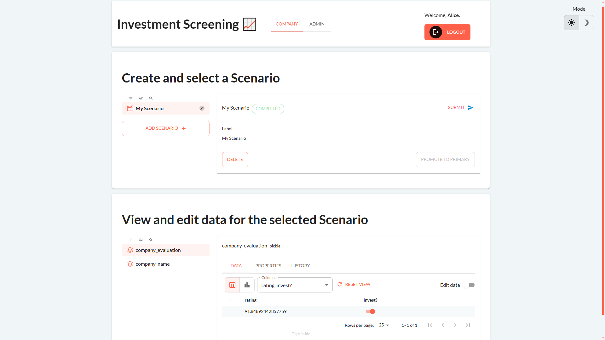
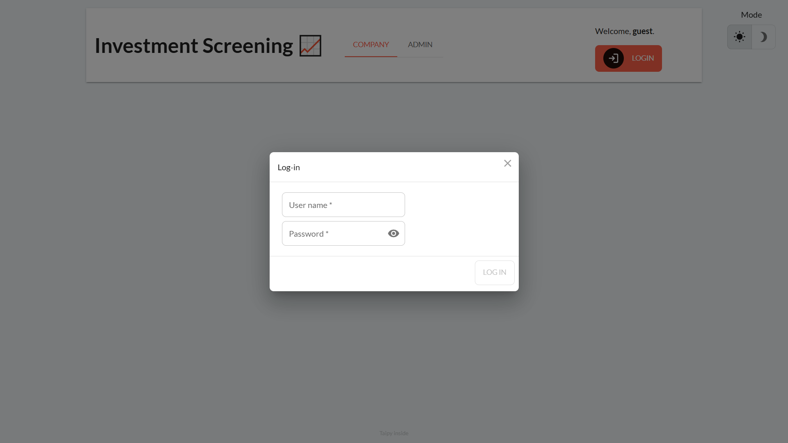
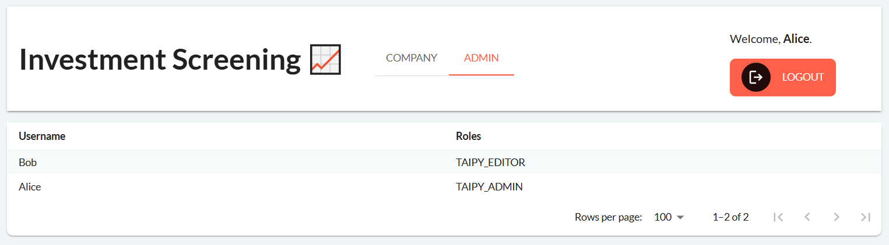
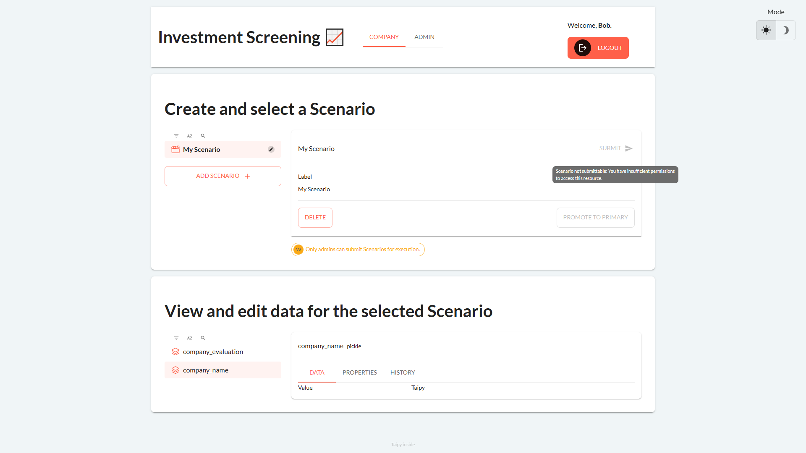
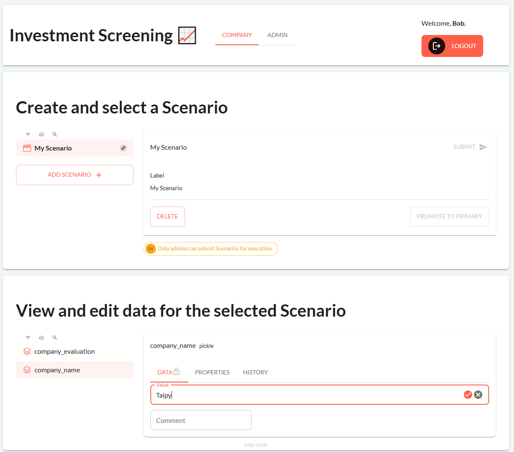
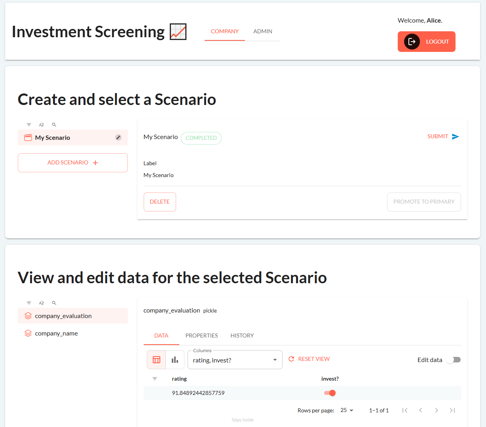

Adding User Management to your Taipy application using Taipy Enterprise is a smooth experience — integration is intuitive, and just makes sense. This is because Taipy was designed from the beginning to be paired with Taipy Enterprise for secure and easy-to-develop User Management.

!!! note "Taipy Enterprise edition"

    Taipy provides robust, business-focused applications tailored for enterprise
    environments. To maintain standards of security and customization, these
    applications are proprietary like this application. If you're looking for solutions
    that are immediately deployable and customizable to your business needs, we invite
    you to try them out and contact us for more detailed information.


    [Try it live](https://investment-screening.taipy.cloud){: .tp-btn target='blank' }
    [Contact us](https://taipy.io/book-a-call){: .tp-btn .tp-btn--accent target='blank' }

{width=80% : .tp-image-border}

In this tutorial, we will create an application for an investment firm use case. This investment firm is testing out a **new screening model to evaluate companies** that they should invest in. This comprehensive screening model is **expensive to run** because it requires access to paid data sources — accordingly, our application’s purpose is to:

1. Allow Bob, the **analyst**, to add companies that look promising for investment; and
2. Allow Alice, the **manager**, to submit companies to the screening model.

This way, Alice is able to vet beforehand if a company added by Bob is worth the cost of running the screening model.

In developing this multi-page application, we will demonstrate these features of Taipy Enterprise:

1. **Permissions** for **Scenario and Data Management** using [**predefined roles**](../../../userman/advanced_features/auth/authorization.md#permissions-for-scenario-and-data-management) ("TAIPY_EDITOR", "TAIPY_ADMIN", etc.);
2. **Authorizing** that a user possesses **specified roles** using a [*RoleTraits*](../../../userman/advanced_features/auth/authorization.md#role-traits-value) filter (*AnyOf*, *AllOf* and *NoneOf*);
3. Managing **role-based page access** using [*AuthorizedPage*](https://docs.taipy.io/en/latest/refmans/reference/pkg_taipy/pkg_enterprise/pkg_gui/AuthorizedPage/);
4. **Hiding elements** based on the user’s roles;
5. And more.

This tutorial focuses on Taipy Enterprise features, and assumes some understanding of Taipy GUI and Scenario Management concepts. Please consult the useful User Manual and Tutorials if you have trouble understanding the latter!

# 1. Folder structure

First off, let’s take a look at the final folder structure that we’ll end up with:

```
src/
├─ algo/
│  ├─ model.py  # Contains the function to call the screening model
├─ config/
│  ├─ auth.py  # Configuration for Taipy auth
│  ├─ tpconfig.py  # Configuration for Taipy scenario management
├─ assets/  # Login/logout icons
│  ├─ login_icon.svg
│  ├─ logout_icon.svg
├─ pages/  # Application pages
│  ├─ company.py
│  ├─ admin.py
│  ├─ login.py
├─ main.py
├─ .env

```

# 2. Business logic

We’ll start with the business logic and scenario management.

First, we have the screening model algorithm:

```python
# algo/model.py
import hashlib

import numpy as np
import pandas as pd

def evaluate_company(company_name: str):
    seed = np.frombuffer(hashlib.sha256(company_name.encode("utf-8")).digest(), dtype=np.uint32)
    rng = np.random.default_rng(seed=seed)

    evaluation_df = pd.DataFrame({"rating": [rng.random() * 100]})
    evaluation_df["invest?"] = evaluation_df["rating"] > 80

    return evaluation_df

```

This tutorial does not actually describe a cutting-edge screening model — we will have to make do with a dummy function that takes a company name and outputs a random rating between 0 and 100.

Next up, we have the Taipy scenario management configuration to wrap our algorithm:

```python
# config/tpconfig.py
from taipy import Config

from algo.model import evaluate_company

company_name_cfg = Config.configure_pickle_data_node(id="company_name", default_data="example company name")
company_evaluation_cfg = Config.configure_pickle_data_node(id="company_evaluation")

evaluate_company_task_cfg = Config.configure_task(
    id="evaluate_company",
    function=evaluate_company,
    input=company_name_cfg,
    output=company_evaluation_cfg
)

scenario_cfg = Config.configure_scenario(
    id="scenario",
    task_configs=[evaluate_company_task_cfg],
)

```

Pretty standard configuration here — the **"company_name" data node** is passed to the **"evaluate_company" task**, which outputs our target **"company evaluation" data node**.

We expect Bob to create scenarios and edit "company_name" with companies that he thinks are promising to invest in. Then, Alice should filter through these scenarios, and selectively submit some scenarios to be processed by the screening model.

# 3. Auth configuration

In our first Taipy Enterprise feature, we will define the Taipy authentication and authorization configuration. 

Note that Taipy Enterprise supports several authentication protocols which you can check out [here](../../../userman/advanced_features/auth/authentication.md). To properly secure your application, you **should use an established supported protoco**l like LDAP or Microsoft Entra ID. However, for our purpose, we will use an **internal password-based protocol** simply called "taipy". This lets us get started quickly, before **migrating to one of the aforementioned protocols** at a later time.

First, Taipy’s "taipy" protocol expects a "*TAIPY_AUTH_HASH*" environment variable used to [salt the password](https://en.wikipedia.org/wiki/Salt_(cryptography)) before it is hashed.

We’ll do this in an "*.env*" file:

```toml
# .env
TAIPY_AUTH_HASH="my-secret-salt"

```

Then, we configure Taipy auth:

```python
# config/auth.py
from dotenv import load_dotenv
from taipy import Config

load_dotenv()

TAIPY_ADMIN_ROLE = "TAIPY_ADMIN"
TAIPY_EDITOR_ROLE = "TAIPY_EDITOR"
APPLICATION_ROLES = [TAIPY_ADMIN_ROLE, TAIPY_EDITOR_ROLE]

USER_ROLES = {
    "Bob": [TAIPY_EDITOR_ROLE],
    "Alice": [TAIPY_ADMIN_ROLE],
}

Config.configure_authentication(
    protocol="taipy",
    roles=USER_ROLES,
    passwords={
        "Bob": "hbUJOvZLdsMu8h0f3Or3BeVgzAl5sES",  # taipy.auth.hash_taipy_password("Bob")
    }
)

```

We perform the configuration with the `Config.configure_authentication`  method. As always, we could have defined this as a TOML file instead. First, we set the authentication protocol as "taipy". Then, we pass 2 additional parameters specific to the "taipy" protocol:

1. *roles* : `dict[str, list[str]]`
    
    A dictionary mapping usernames to a list of user roles. User roles can be **any string of our choosing**, e.g. "writer" or "publisher". We can then write our application logic to check for these roles.
    
    In this application, we opted for some **predefined roles** provided by Taipy which have some unique functionality for scenario management, namely "TAIPY_ADMIN" and "TAIPY_EDITOR".
    
2. *passwords* : `dict[str, str]`
    
    A dictionary mapping usernames to their hashed password string. Password hashes should be generated using `taipy.auth.hash_taipy_password`.
    
    Notice that we did not provide an entry for Alice’s password. By default, if omitted, the password hash is automatically generated with the username as the password. In other words, we can sign in as the user "Alice" with the password "Alice".
    

# 4. Login page

We’re down to our final 4 files, and we’ll start with the login page. This is where things get the most interesting, and it’s worth spending some time to understand what’s going on.

A user can be identified through a [`taipy.auth.Credentials`](https://docs.taipy.io/en/latest/refmans/reference/pkg_taipy/pkg_auth/Credentials/) object which holds information about its username and roles. We typically obtain an **authenticated Credentials object** using:

1. [`taipy.auth.login`](https://docs.taipy.io/en/latest/refmans/reference/pkg_taipy/pkg_auth/login/); or
2. [`taipy.enterprise.gui.login`](https://docs.taipy.io/en/latest/refmans/reference/pkg_taipy/pkg_enterprise/pkg_gui/login/).

Although they both return valid Credentials objects (or raise errors), the **latter function** differs in that it also **performs some operations behind-the-scenes** to enable **interoperability with Taipy GUI** (e.g. *AuthorizedPage*, described in a later section). Consequently, we’ll be using the latter function for our application.

Let’s look at the code for the login page:

```python
# pages/login.py
import taipy as tp
import taipy.gui.builder as tgb
from taipy.auth import Credentials
from taipy.gui import State, navigate, notify

def get_guest_credentials():
    return Credentials(user_name="guest", roles=[])

def handle_login(state, username, password):
    state.credentials = tp.enterprise.gui.login(state, username, password)
    # Failed authentication would raise an AuthenticatorError exception, handled by main.on_exception
    notify(state, "success", f"You are now logged in as {state.credentials.user_name}.")
    navigate(state, "/", force=True)

def handle_logout(state):
    tp.enterprise.gui.logout(state)
    state.credentials = get_guest_credentials()
    notify(state, "error", "You have logged out.")
    navigate(state, "/", force=True)

def on_login(state: State, id: str, payload: dict):
    username, password = payload["args"][:2]
    if username is None:  # The user canceled the login request
        return navigate(state, "/", force=True)
    handle_login(state, username, password)

with tgb.Page() as login_page:
    tgb.login()

```

We don’t need much code for this page. The actual Page object (`login_page`) contains a single element: a [login control](../../../refmans/gui/viselements/generic/login.md). Interacting with the login control implicitly calls the "on_login" callback function (unless a callback function is explicitly assigned via `tgb.login`’s "on_action" parameter).

In turn, our "on_login" callback function calls "handle_login", where we implement the main logic for attempting a login. We choose to do this in 3 steps:

1. `state.credentials = tp.enterprise.gui.login(state, username, password)`.
    
    Assign the validated Credentials to the `state.credentials` [State variable](../../../userman/gui/binding.md). Remember that this function also does some behind-the-scenes magic to authenticate the user in this session.
    
    Note that although this function may raise an *AuthenticationError* exception, we choose not to catch it immediately, but instead let the main "on_exception" callback handle it (more on this later).
    
2. Notify the user that the login was successful.
3. Navigate the user to the root page.

{width=80% : .tp-image-border}
/// caption
Login page: Guests log in by interacting with the login control, which calls the "on_login" callback.
///


Similarly, we define a "handle_logout" function:

1. `tp.enterprise.gui.logout(state)`.
    
    Log the user out. Again, this GUI function removes the credentials from the associated session.
    
2. `state.credentials = get_guest_credentials()`.
    
    Here, we’re assigning a "blank" Credentials object to `state.credentials`, which has no user roles. This is for our convenience so that we can always use this `state.credentials` object to get a user’s roles — returning an empty list if the user is not authenticated.
    
    It is an important distinction that `state.credentials` is a state variable of our own making — **it is not some reserved keyword** internally used by Taipy Enterprise. Notably and contrastingly, at this point, calling [`taipy.enterprise.gui.get_credentials`](https://docs.taipy.io/en/latest/refmans/reference/pkg_taipy/pkg_enterprise/pkg_gui/get_credentials/) would return None, since the previous logout statement has removed session credentials.
    
3. Notify the user that the logout was successful.
4. Navigate the user to the root page.

# 5. Admin page

Taking a quick break from the fancier stuff, let’s make a simple page:

```python
# pages/admin.py
import pandas as pd
import taipy.gui.builder as tgb

from config.auth import USER_ROLES

with tgb.Page() as admin_page:
    with tgb.part(class_name="container"):
        user_df = pd.DataFrame(
            [(username, ", ".join(roles)) for username, roles in USER_ROLES.items()],
            columns=["Username", "Roles"],
        )
        tgb.table("{user_df}")

```

This page simply displays a table with all configured usernames and their respective roles. Later, we will demonstrate how we can **limit access to this page** so that only users with the "TAIPY_ADMIN" role — such as Alice — may access it.

The `admin_page`, viewed as Alice:

{width=80% : .tp-image-border}

# 6. Company page

The third and last page is the company page. This is the page that Bob and Alice will use to create, edit and submit scenarios.

```python
import taipy.gui.builder as tgb
from taipy.auth import AnyOf

from config.auth import TAIPY_ADMIN_ROLE

selected_scenario = None
selected_data_node = None

is_admin = AnyOf([TAIPY_ADMIN_ROLE], True, False)

with tgb.Page() as company_page:
    with tgb.part(class_name="container card mb1"):
        tgb.text("# Create and select a Scenario", mode="md")
        with tgb.layout(columns="1 3", gap="1.5em"):
            tgb.scenario_selector("{selected_scenario}")
            with tgb.part():
                tgb.scenario(
                    "{selected_scenario}",
                    show_tags=False,
                    show_properties=False,
                    show_sequences=False,
                    expanded=True,
                    expandable=False,
                )
                with tgb.part(render=lambda credentials: not is_admin.get_traits(credentials), class_name="mt1"):
                    tgb.status("{('warning', 'Only admins can submit Scenarios for execution.')}")

    with tgb.part(class_name="container card mb1"):
        tgb.text("# View and edit data for the selected Scenario", mode="md")
        with tgb.layout(columns="1 3", gap="1.5em"):
            tgb.data_node_selector("{selected_data_node}", show_pins=False, scenario="{selected_scenario}")
            tgb.data_node("{selected_data_node}", show_properties=False, expanded=True, expandable=False)

```

If you’re already familiar with Taipy GUI and Scenario Management, you will notice that we used some [scenario management controls](../../../refmans/gui/viselements/index.md#scenario-and-data-management-controls), namely: *scenario_selector*, *scenario*, *data_node_selector* and *data_node*. 

In fact, the only new thing present is the *AnyOf* [role trait](../../../userman/advanced_features/auth/authorization.md#role-traits) filter. A role trait filter takes 3 parameters:

1. *filters*: A list of roles to check.
2. *success*: The returned value if the success condition is met.
3. *failure*: The returned value if the success condition is not met.

Additionally, *success* and *failure* could also be role trait filters, which would be **recursively evaluated** until some value is returned.

Rather self-explanatorily, the *AnyOf* role traits filter checks if a user has any of the listed roles. In our example, we created one like so: `is_admin = AnyOf([TAIPY_ADMIN_ROLE], True, False)`. Then, in our page code, we used the expression `not is_admin.get_traits(credentials)` for a part’s render property. Hence, the full expression (with the negation from `not`) evaluates as `True` if the user does not have the "TAIPY_ADMIN" role.

{width=80% : .tp-image-border}
/// caption
Company page: Bob is unable to click the button as he has insufficient permissions to submit the scenario.
///

Note that using scenario management controls abstracts away some auth functionality for our convenience. For example, the *scenario* control’s submit button is **automatically disabled** when the **user does not have permission** to execute a scenario. Often, you may wish to use generic controls like selectors and buttons, which trigger user-defined callbacks that call scenario management functionality. In this case, an added step is to use the [Authorize](https://docs.taipy.io/en/latest/refmans/reference/pkg_taipy/pkg_auth/Authorize/) context manager when performing a protected operation, for example:

```python
import taipy as tp
from taipy.enterprise.auth import Authorize
from taipy.enterprise.core.exceptions import PermissionDenied

def submit_scenario(state):
    try:
        with Authorize(state.credentials):
            tp.submit(state.selected_scenario)
    except PermissionError:
        # Handle exception
        ...
```

Of course, yet another approach when using generic controls like selectors and buttons is to simply set its [active](https://docs.taipy.io/en/develop/refmans/gui/viselements/generic/button/#p-active) property to an expression that checks for the desired credentials, for example:

```python
import taipy.gui.builder as tgb
from taipy.gui import notify

tgb.button(
	  label="Only for admins",
    active=lambda credentials: "TAIPY_ADMIN" in credentials.get_roles(),
    on_action=lambda state: notify(state, "info", "You are an admin!")
)
```

# 7. Tying it together in main.py

Finally, we are ready to put the whole application together:

```python
# main.py
import taipy as tp
import taipy.gui.builder as tgb
from taipy.auth import AnyOf
from taipy.auth.exceptions import AuthenticatorError, InvalidCredentials
from taipy.enterprise.gui import AuthorizedPage
from taipy.gui import Gui, Icon, State, navigate

from config.auth import APPLICATION_ROLES, TAIPY_ADMIN_ROLE
from config.tpconfig import scenario_cfg
from pages.admin import admin_page
from pages.company import company_page
from pages.login import get_guest_credentials, handle_logout, login_page

credentials = get_guest_credentials()

def on_exception(state: State, function_name: str, exception):
    print(f"Exception in {function_name}: {exception}")
    if isinstance(exception, InvalidCredentials) or isinstance(exception, AuthenticatorError):
        handle_logout(state)

with tgb.Page() as guest_page:
    with tgb.part(class_name="container card"):
        tgb.text("You do not have access to view this page.")

pages = {
    "company": AuthorizedPage(AnyOf(APPLICATION_ROLES, company_page, guest_page)),
    "admin": AuthorizedPage(AnyOf([TAIPY_ADMIN_ROLE], admin_page, guest_page)),
}

with tgb.Page() as root_page:
    tgb.toggle(theme=True)
    with tgb.part(class_name="header sticky container p1 mb1"):
        with tgb.layout(columns="1fr 1fr 12em", class_name="align-columns-center"):
            with tgb.part():
                tgb.text("Investment Screening 📈", class_name="h1")
            with tgb.part(class_name="align-columns-stretch"):
                navbar_pages = [(f"/{page_name}", page_name) for page_name in list(pages.keys())]
                tgb.navbar(lov=navbar_pages, class_name="fullheight")
            with tgb.part():
                button_class_name = "plain"
                # Display login button if user has the "blank" guest credentials
                with tgb.part(render=lambda credentials: len(credentials.get_roles()) == 0):
                    tgb.text("Welcome, **guest**.", mode="md")
                    login_icon = Icon(text="Login", path="assets/login.svg")
                    tgb.button(
                        "{login_icon}",
                        on_action=lambda state: navigate(state, "/login", tab="_self"),
                        class_name=button_class_name,
                    )
                # Display logout button if user is logged in
                with tgb.part(render=lambda credentials: len(credentials.get_roles()) > 0):
                    tgb.text("Welcome, **{credentials.user_name[:10]}**.", mode="md")
                    logout_icon = Icon(text="Logout", path="assets/logout.svg")
                    tgb.button("{logout_icon}", on_action=handle_logout, class_name=button_class_name)

# Add root and login pages
pages["/"] = root_page
pages["login"] = login_page

if __name__ == "__main__":
    orchestrator = tp.Orchestrator()
    orchestrator.run()
    gui = Gui(pages=pages)
    gui.run(title="Investment Screening")

```

Since this file is a little bit longer than the others, we’ll break it down in sections:

## 7.1 Initialize credentials

Starting from the top, after the imports, we initialize `credentials = get_guest_credentials()`.  By defining this in our main module, we now have a global `state.credentials` state variable in our application. As mentioned earlier, we’re giving non-logged in users this "blank" guest credentials, so that `state.credentials` is always of type *Credentials* — and guest users can be identified by their empty role list.

## 7.2 "on_exception" global callback

Next, we define "on_exception". This is the global callback function that Taipy implicitly calls when it encounters an unhandled exception. In this case, our function calls "handle_logout" to **reassign guest credentials** if an *AuthenticationError* or *InvalidCredentials* exception is unhandled in the application. 

Remember how in "login.handle_login" we opted not to handle the exception that `tp.enterprise.gui.login` may raise? Therefore, if an *AuthenticationError* is raised, it would get handled by this function.

## 7.3 Adding pages

We usually create a multi-page application in Taipy by defining a dictionary mapping page names to a Taipy *Page* (like `company_page`). This dictionary is then passed to the `taipy.gui.Gui` "pages" parameter.

This time however, we may want to show different pages depending on the user’s roles. For example, we only want Alice, the manager (who has the "TAIPY_ADMIN" role), to be able to view `admin_page`. Any user without this role should not be able to view the page.

To do this, we started by creating `guest_page`, a short page simply informing the user that they aren’t signed in. Now, we want to make it so that navigating to "/admin" may conditionally show `admin_page` or `guest_page`, depending on the user’s roles. We can do this with *AuthorizedPage*.

See the following snippet:

```python
pages = {
    "company": AuthorizedPage(AnyOf(APPLICATION_ROLES, company_page, guest_page)),
    "admin": AuthorizedPage(AnyOf([TAIPY_ADMIN_ROLE], admin_page, guest_page)),
}
```

Where the value would have usually been a *Page*, here, instead we use an *AuthorizedPage*. This class takes a *RoleTraits* filter, and its *success* and *failure* parameters should be *Page* objects (or role traits filters to recurse further). Accordingly, the "/admin" route will now display `admin_page` to users with the "TAIPY_ADMIN" role, and `guest_page` otherwise.

{width=80% : .tp-image-border}
/// caption
Admin page: Bob does not have the "TAIPY_ADMIN" role, and sees `guest_page` instead.
///

## 7.4 Adding the root page

Finally, we can define the [root page](../../../userman/gui/pages/index.md#root-page). As you may already know, the root page will be present on every page of a multi-page application, making it the perfect place to put our header — which should contain elements for navigation, and logging in/out. Completed it will look like this:

{width=80% : .tp-image-border}

Looking at the `root_page` object, we are providing log in/out functionality through buttons, contained in parts which are **rendered based on 2 mutually exclusive expressions**:

1. `len(credentials.get_roles()) == 0`
    1. The user is a guest.
    2. Display the login button, which navigates the user to "/login".
2. `len(credentials.get_roles()) > 0`
    1. The user is logged in.
    2. Display the logout button, which calls the "handle_logout" callback.

Accordingly, the relevant button is shown to the user depending on their login status.

# 8. Tutorial outcome

Bob, the **analyst**, can now create a scenario, and add a company name that he thinks is a good investment. He **has no permission** to submit the scenario for execution:

{width=80% : .tp-image-border}

Alice, the **manager**, will see the scenario that Bob created, and can decide if it’s worth submitting to the screening model. She **has permission** to submit the scenario for execution:

{width=80% : .tp-image-border}

**Invest!**

You should now be familiar with the key concepts powering User Management in Taipy Enterprise! Additionally, you should also know how to add authentication and authorization to your Taipy GUI and Scenario Management applications with straightforward and painless integration.
