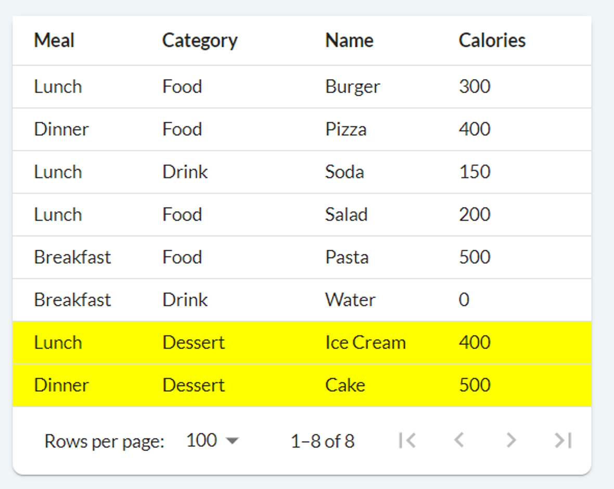
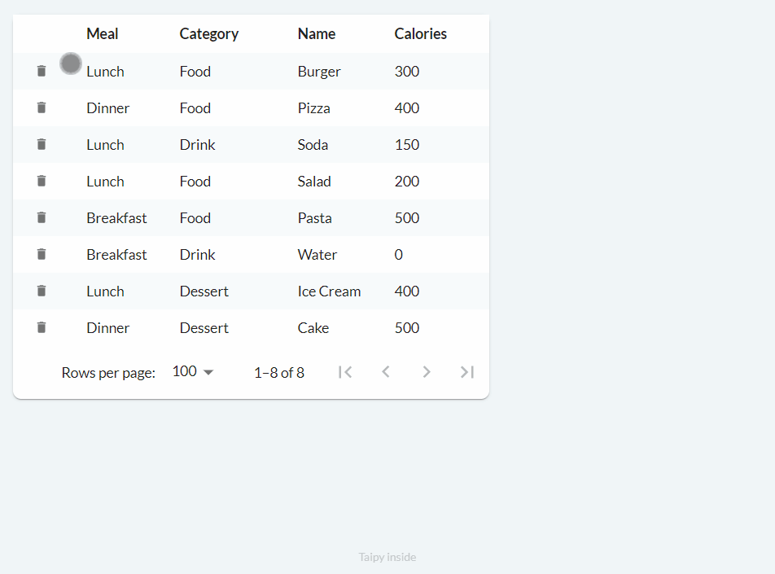

Tables in Taipy are not just for showing data, they also let you control things. When you're
making an application with data (which Taipy is great at!), you can use Taipy's tables and their
cool features.

{width=90% : .tp-image }

This article shows you the settings most people want when they make tables. If you want to do
something with tables that's not in this article, you can check the
[table control](../../../refmans/gui/viselements/generic/table.md) documentation for a big list of stuff!

You can see all the code with the table features we talked about at the end of this article.

{width=50% : .tp-image-border }

First, let's see how you make tables in Taipy:

```python title="main.py"
from taipy.gui import Gui, Markdown
import pandas as pd

if __name__ == "__main__":
    food_df = pd.DataFrame({
        "Meal": ["Lunch", "Dinner", "Lunch", "Lunch", "Breakfast", "Breakfast", "Lunch", "Dinner"],
        "Category": ["Food", "Food", "Drink", "Food", "Food", "Drink", "Dessert", "Dessert"],
        "Name": ["Burger", "Pizza", "Soda", "Salad", "Pasta", "Water", "Ice Cream", "Cake"],
        "Calories": [300, 400, 150, 200, 500, 0, 400, 500],
    })

    main_md = Markdown("<|{food_df}|table|>")

    Gui(page=main_md).run()
```

The table definition `<|{food_df}|table|>` (a syntax often used in Taipy) has these parts:

1. `{food_df}`: This is a variable that holds data, like what someone ate in a day.
2. `table`: This is control type name.

In this example, the data in *food_df* is a **pandas DataFrame**. If it works better for what
you're doing, you can also use regular Python lists or NumPy arrays.

When you run the code above, you get a page that looks like this:

{width=50% : .tp-image-border }

To add aggregation to our table, we need to specify the column to group, and the aggregation
function to be performed. In our food tracker example, an application could be to:

1. Group by *Category*; and
2. Sum the *Calories*.

```python
main_md = Markdown("<|{food_df}|table|group_by[Category]=True|apply[Calories]=sum|>")
```
To configure table aggregation, you add two properties to the table:

1. `group_by[Category]=True`: This tells the table to group data by the **Category** column.
   You can use this property multiple times with different column names.

2. `apply[Calories]=sum`: This specifies that the **Calories**' column should be combined
   using the `sum` function. You can choose from various aggregation functions
   like `first` (default), `last`, `count`, `sum`, `mean`, `median`, `min`, `max`, and `std`.<br/>
   You can even use a custom function if needed.

Note that the **Meal** and **Name** columns don't have a specific aggregation function assigned,
so they default to `first`.

As a side note, if it's more suitable for your needs, you can create a separate table to display
the aggregated data. To do this, you can make a new DataFrame (e.g., *df_agg*) from *df* with
the desired changes, connect it to a new table, and update the new DataFrame when *df* changes.
However, this topic is about showing toggleable aggregation by dynamically updating the same table.

## Filtering Data

We can add filters to our table.

{width=50% : .tp-image-border }

Filters help us choose specific data by using one or more columns. For instance, we can pick
only the values above 300 in the **Calories** column or just view **Breakfast** in the **Meal**
column.

To add filters to our table, it's easy: we set the `filter` property to True, like this:

```python
main_md = Markdown("<|{food_df}|table|filter=True|>")
```

As with all control Boolean properties, we can remove the '=True' part, making it:
`<|{food_df}|table|filter|>`.

## Styling (Stylekit)

You can customize the style of a table in Taipy using two properties:

1. *class_name*: This property allows you to apply a CSS class to the entire table.

2. *row_class_name*: With this property, you can apply a CSS class to specific rows, which you
   specify in Python.

### Property 1: class_name

The Stylekit is a collection of pre-defined CSS classes created by Taipy. It offers a simple way
to personalize the appearance of your Taipy web application, and it's user-friendly, even for
those who have no knowledge of CSS.

We achieved this by just putting the **rows-bordered** Stylekit CSS class into the `class_name`
property of the table control:

```python
main_md = Markdown("<|{food_df}|table|class_name=rows-bordered|>")
```

To learn more about how Stylekit supports Taipy tables, you can check the documentation
[here](../../../refmans/gui/viselements/generic/table.md#styling). If you want to explore the
many features of Stylekit beyond tables in Taipy, you can read this helpful
[tip article](../../articles/css_style_kit/index.md)!

In addition to the handy pre-defined Stylekit classes, you also have the option to define and
use your own CSS classes. To do this, you can create a CSS file containing your custom style
sheet code and provide the file path as a string to the *css_name* parameter of the `Gui` object.

Alternatively, you can follow an easier approach by naming the CSS file the same as your Python
script (but changing the extension to .css) and placing it in the same directory as the Python
script. For example, if your Taipy application code is in `main.py`, your CSS code can go in
`main.css` in the same directory. You can find more details about this
[here](../../../userman/gui/styling/index.md#style-sheets).

### Property 2: row_class_name

To have more precise control over our styling, we can utilize the *row_class_name* property of
the table control to assign CSS classes to individual rows in the table. For instance, we can assign
a user-defined **highlight-row** CSS class to rows where the **Category** column is **Dessert** to
give them a yellow background.

{width=50% : .tp-image-border }

The *row_class_name* property accepts a function. This function is applied to each row of the table
and returns a string specifying the CSS class to be used for that particular row. To create the
table mentioned above, you can use the following code:

```python title="main.py"
def table_style(state, index, row):
    return "highlight-row" if row.Category == "Dessert" else ""

table_properties = {
    "class_name": "rows-bordered rows-similar", # optional
    "row_class_name": table_style,
}

main_md = Markdown("<|{food_df}|table|properties=table_properties|>")
# or Markdown("<|{food_df}|table|class_name=rows-bordered rows-similar|row_class_name=table_style|>")
```

```css
/* main.css */
.highlight-row td {
    background-color: yellow;
}
```

In our code, we also made use of the  *class_name* property mentioned earlier, and we applied
two Stylekit table classes: **rows-bordered** and **rows-similar**. The **rows-similar** class
removes the default 0.5 opacity from odd rows. While it wasn't necessary, using it does enhance
the table's appearance when applying our **highlight-row** CSS class.

## Modifying Data

Tables offer various properties for modifying data within the table. Notably, the *on_edit*,
*on_add*, and *on_delete* properties can receive user-defined **callback** functions. These
functions are executed when you interact with the table. The interaction element appear when the
table is explicitly defined as *editable*.

Although Taipy comes with default callback function implementation for these properties, we will
define each function ourselves to match our specific needs. We're also including the
[*notify()*](../../../userman/gui/notifications.md) function within our data modification callback
functions to send notifications to the user about their changes.

## Editing (*on_edit*)

When the *editable* property is used, new buttons with a pencil icon are added to each cell.
Clicking it allows the user to modify the value of that cell. If *on_edit* is set to a callback
function, then clicking the tick triggers the callback function:

{width=50% : .tp-image-border }

The following code can be used to implement basic editing functionality:

```python
def food_df_on_edit(state, var_name, payload):
    index = payload["index"] # row index
    col = payload["col"] # column name
    value = payload["value"] # new value cast to the column type
    user_value = payload["user_value"] # new value as entered by the user

    # state.food_df.loc[index, col] = value #  Don't do this!
    old_value = state.food_df.loc[index, col]
    new_food_df = state.food_df.copy()
    new_food_df.loc[index, col] = value
    state.food_df = new_food_df
    notify(state, "I", f"Edited value from '{old_value}' to '{value}'. (index '{index}', column '{col}')")

main_md = Markdown("<|{food_df}|table|editable|on_edit=food_df_on_edit|>")
```

The table documentation provides more information on the function signature which is slightly
different for each data modification property. The code example above is self-explanatory though.

Notice that we did not modify the *food_df* DataFrame with `state.food_df.loc[index, col] = value`.
This is because state variables should be updated by assignment to the variable itself hence why
we instead create a copy of the DataFrame, modify the relevant cell, then assign it back to
*state.food_df*.

## Adding (*on_add*)

Adding and deleting are quite similar to editing. When *editable* is True, a
`button` with a 'plus' icon is included, and when clicked, it triggers the callback function
speficied in the *on_add* property.

{width=50% : .tp-image-border }

We can implement the functionality above as follows:

```python
def food_df_on_add(state, var_name, payload):
    empty_row = pd.DataFrame([[None for _ in state.food_df.columns]], columns=state.food_df.columns)
    state.food_df = pd.concat([empty_row, state.food_df], axis=0, ignore_index=True)

    notify(state, "S", f"Added a new row.")

main_md = Markdown("<|{food_df}|table|editable|on_add=food_df_on_add|>")
```

This code simply adds a new empty row to the top of the table (DataFrame).
You can customize the callback function accordingly if your use case requires
some columns to have a default or set value.

## Deleting (*on_delete*)

Finally, the deletion process works as follows:

{width=50% : .tp-image-border }

We can implement basic functionality with the following code:

```python
def food_df_on_delete(state, var_name, payload):
    index = payload["index"] # row index

    state.food_df = state.food_df.drop(index=index)
    notify(state, "E", f"Deleted row at index '{index}'")

main_md = Markdown("<|{food_df}|table|editable|on_delete=food_df_on_delete|>")
```

## Complete Code

Once more, please note that this tip article doesn't cover all the features of tables in Taipy
comprehensively. If you're seeking a feature that we didn't address here, be sure to refer to
the [documentation](../../../refmans/gui/viselements/generic/table.md) for more information!

Lastly, here's the code that combines all the features we discussed in this article,
used to create the application shown at the beginning of the article:

```python
from taipy.gui import Gui, Markdown, notify
import pandas as pd


def food_df_on_edit(state, var_name, payload):
    index = payload["index"] # row index
    col = payload["col"] # column name
    value = payload["value"] # new value cast to the column type
    user_value = payload["user_value"] # new value as entered by the user

    old_value = state.food_df.loc[index, col]
    new_food_df = state.food_df.copy()
    new_food_df.loc[index, col] = value
    state.food_df = new_food_df
    notify(state, "I", f"Edited value from '{old_value}' to '{value}'. (index '{index}', column '{col}')")


def food_df_on_delete(state, var_name, payload):
    index = payload["index"] # row index

    state.food_df = state.food_df.drop(index=index)
    notify(state, "E", f"Deleted row at index '{index}'")


def food_df_on_add(state, var_name, payload):
    empty_row = pd.DataFrame([[None for _ in state.food_df.columns]], columns=state.food_df.columns)
    state.food_df = pd.concat([empty_row, state.food_df], axis=0, ignore_index=True)

    notify(state, "S", f"Added a new row.")

if __name__ == "__main__":
    food_df = pd.DataFrame({
        "Meal": ["Lunch", "Dinner", "Lunch", "Lunch", "Breakfast", "Breakfast", "Lunch", "Dinner"],
        "Category": ["Food", "Food", "Drink", "Food", "Food", "Drink", "Dessert", "Dessert"],
        "Name": ["Burger", "Pizza", "Soda", "Salad", "Pasta", "Water", "Ice Cream", "Cake"],
        "Calories": [300, 400, 150, 200, 500, 0, 400, 500],
    })

    table_properties = {
        "class_name": "rows-bordered",
        "editable": True,
        "filter": True,
        "on_edit": food_df_on_edit,
        "on_delete": food_df_on_delete,
        "on_add": food_df_on_add,
        "group_by[Category]": True,
        "apply[Calories]": "sum",
    }

    main_md = Markdown("""
# Daily Calorie Tracker

<|{food_df}|table|properties=table_properties|>
    """)

    Gui(page=main_md).run()
```
