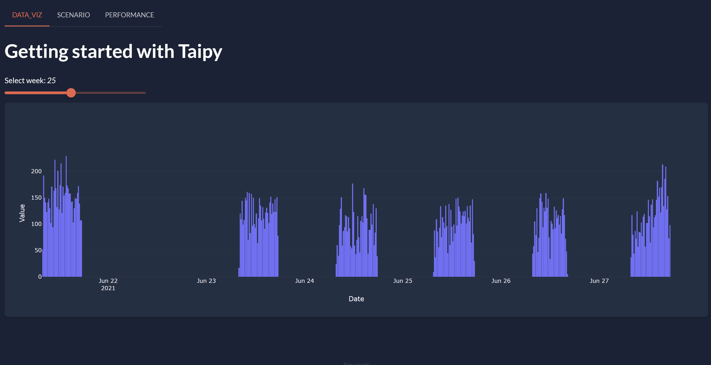

!!! important "Supported Python versions"

    Taipy requires **Python 3.8** or newer.

Welcome to the **Tutorial** guide to create a complete application using Taipy frontend and backend. No prior knowledge is required to complete this Tutorial.

{ width=700 style="margin:auto;display:block;border: 4px solid rgb(210,210,210);border-radius:7px" }

Each step of the **"Tutorial"** focus on basic concepts of *Taipy*. One step aims to create and complete only one file.

## Before we begin

Three packages have to be installed:

 1. **Taipy** package, it requires Python 3.8 or newer;

 2. **scikit-learn**: A Machine-Learning package that will be used in the Tutorial user code;

 3. **statsmodels**: Another package for statistics also used in the user code.

``` console
$ pip install taipy
$ pip install scikit-learn
$ pip install statsmodels
```

!!! info 

    `pip install taipy` is the preferred method to install the latest stable version of Taipy.
    
    If you don't have [pip](https://pip.pypa.io) installed, this 
    [Python installation guide](http://docs.python-guide.org/en/latest/starting/installation/)
    can guide you through the process.


Once Taipy is installed, you can use the CLI to create the scaffolding. The default template will be used throughout the creation of the application.

``` console
> taipy create --template default
Application root folder name [taipy_application]:
Application main Python file [main.py]:
Application title [Taipy Application]:
Page names in multi-page application? []: data_viz scenario performance
Does the application use scenario management or version management? [No]: yes
Does the application use Rest API? [No]: no
```


So, without further delay, let's begin to code!

## Steps

1. [Data Visualization page](step_01/ReadMe.md)

2. [Algorithms used](step_02/ReadMe.md)

3. [Backend Configuration](step_03/ReadMe.md)

4. [Scenario page](step_04/ReadMe.md)

5. [Performance page](step_05/ReadMe.md)
