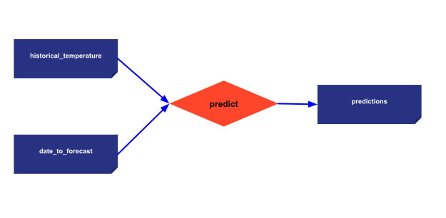

> You can download the code for
<a href="./../src/step_01.py" download>Step 1</a> 
or all the steps <a href="./../src/src.zip" download>here</a>. 

*Estimated Time for Completion: 15 minutes; Difficulty Level: Beginner*

Before looking at some code examples, to apprehend what is a *Scenario*, you need to 
understand the *Data node* and *Task* concepts.

- [**Data Nodes**](../../../../manuals/core/concepts/data-node.md): are the translation of 
  variables in Taipy. Data Nodes don't contain the data itself but point to the data and know 
  how to retrieve it. These Data Nodes can point to different types of data sources like CSV 
  files, Pickle files, databases, etc., and they can represent various types of Python variables 
  such as integers, strings, data frames, lists, and more. They are fully generic and can be 
  used to represent datasets, parameters, KPIs, intermediate data, or any variable. 

- [**Tasks**](../../../../manuals/core/concepts/task.md): are the translation of functions in 
  Taipy where their inputs and outputs are data nodes.

- [**Scenarios**](../../../../manuals/core/concepts/scenario.md): Scenarios are created by 
  combining Data Nodes and Tasks to form a graph that maps the execution flow. Each scenario can be 
  submitted, resulting in the execution of its tasks. 
  End-Users very often require modifying various parameters to reflect different business 
  situations. Taipy provide the framework to execute various scenarios under different 
  situations (i.e. various data/parameters values set by end-users).

- [**Configuration**](../../../../manuals/core/config/index.md) is a structure to define 
  scenarios. It represents our Direct Acyclic Graph(s); it models the data sources and 
  parameters, as well as tasks. Once defined, a configuration acts like a superclass; it is used 
  to instantiate different scenario instances.

# Configuring a Scenario

Let’s consider a simple scenario representing a single function `predict` taking two inputs: a 
dataset and a date to forecast and generate a prediction for the chosen date. 

See the function code below:

```python
import pandas as pd

def predict(historical_temperature: pd.DataFrame, date_to_forecast: str) -> float:
    print(f"Running baseline...")
    historical_temperature['Date'] = pd.to_datetime(historical_temperature['Date'])
    historical_same_day = historical_temperature.loc[
        (historical_temperature['Date'].dt.day == date_to_forecast.day) &
        (historical_temperature['Date'].dt.month == date_to_forecast.month)
    ]
    return historical_same_day['Temp'].mean()
```
The scenario can be represented as the following graph:

{ width=700 style="margin:auto;display:block;border: 4px solid rgb (210,210,210);border-radius:7px" }

Three Data Nodes are being configured (**historical_temperature**, **date_to_forecast** and 
**predictions**). The task **predict** links the three Data Nodes through the Python function.

!!! example "Configuration"

    === "Python configuration"

        **Alternative 2:** Configuration using Python Code

        Here is the code to configure a simple scenario.

        ```python
        # Configuration of Data Nodes
        historical_temperature_cfg = Config.configure_data_node("historical_temperature")
        date_to_forecast_cfg = Config.configure_data_node("date_to_forecast")
        predictions_cfg = Config.configure_data_node("predictions")

        # Configuration of tasks
        predict_cfg = Config.configure_task(id="predict",
                                                function=predict,
                                                input=[historical_temperature_cfg, date_to_forecast_cfg],
                                                output=predictions_cfg)

        # Configuration of scenario
        scenario_cfg = Config.configure_scenario(id="my_scenario", task_configs=[predict_cfg])
        ```

    === "Using Taipy Studio"

        **Alternative 1:** Configuration using Taipy Studio

        By watching the animation below, you can see how this configuration gets created using 
        Taipy Studio. In fact, Taipy Studio is an editor of a TOML file specific to Taipy. It 
        lets you edit and view a TOML file that will be used in our code.

        <video controls width="400">
            <source src="/step_01/config_01.mp4" type="video/mp4">
        </video>

        To use this configuration in our code (`main.py` for example), we must load it and 
        retrieve the `scenario_cfg`. This `scenario_cfg` is the basis to instantiate our scenarios.

        ```python
        Config.load('config_01.toml')

        # my_scenario is the id of the scenario configured
        scenario_cfg = Config.scenarios['my_scenario']
        ```

The configuration is done! Let's use it to instantiate scenarios and submit them.

First, run the Core service in your code (`tp.Core().run()`). Then, you can play with Taipy: 

- create scenarios,

- write your input data nodes,

- submit them to run the task

- read your output data node.

Creating a scenario (`tp.create_scenario(<Scenario Config>)`) creates all its related entities 
(**tasks**, **Data Nodes**, etc). These entities are being created thanks to the previous 
configuration. Still, no scenario has been run yet. `tp.submit(<Scenario>)` is the line of code 
that triggers the run of all the scenario-related tasks.

```python
import taipy as tp

# Run of the Core
tp.Core().run()

# Creation of the scenario and execution
scenario = tp.create_scenario(scenario_cfg)
scenario.historical_temperature.write(data)
scenario.date_to_forecast.write(dt.datetime.now())
tp.submit(scenario)

print("Value at the end of task", scenario.predictions.read())
```

Results:

```
[2022-12-22 16:20:02,740][Taipy][INFO] job JOB_predict_... is completed.
Value at the end of task 23.45
```    

In this code, you can see how to create qnd submit scenarios, retrieve data nodes from, 
read and write data. Many other functions are described in the manuals, in particular in the 
[taipy](../../../../manuals/reference/pkg_taipy.md), 
[scenario](https://docs.taipy.io/en/develop/manuals/core/entities/scenario-cycle-mgt/) and 
[data node](https://docs.taipy.io/en/develop/manuals/core/entities/data-node-mgt/) documentation 
pages.

# Visual elements

The small piece of code of the previous section shows how to manage scenarios. The scenario or data 
node management is usually done by end-users through a graphical interface. Taipy provides 
visual elements dedicated to Scenario management to replace the code above.

Add these few lines to the code of your script. This creates a web application, so end-users can:

- select scenarios,

- create new ones,

- submit them,

- access their properties.

```python
import taipy as tp

def save(state):
    # write values of Data Node to submit scenario
    state.scenario.historical_temperature.write(data)
    state.scenario.date_to_forecast.write(state.date)
    tp.gui.notify(state, "s", "Saved! Ready to submit")

date = None
scenario_md = """
<|{scenario}|scenario_selector|>
<|{date}|date|on_change=save|active={scenario}|>
<|{scenario}|scenario|>
<|{scenario}|scenario_dag|>

<|Refresh|button|on_action={lambda s: s.assign("scenario", scenario)}|>
<|{scenario.predictions.read() if scenario else ''}|>
"""

tp.Gui(scenario_md).run()
```

The [Scenario management visual elements](../../../../manuals/gui/corelements/index.md)
provide all the necessary controls to manage and access scenarios and data nodes. In fact,
creating a Scenario based application connected to your pipelines has never been simpler.

{ width=700 style="margin:auto;display:block;border: 4px solid rgb(210,210,210);border-radius:7px" }

# Entire code

```python
from taipy import Config
import taipy as tp
import pandas as pd


data = pd.read_csv("https://raw.githubusercontent.com/Avaiga/taipy-getting-started-core/develop/src/daily-min-temperatures.csv")

# User function used by Taipy
def predict(historical_temperature: pd.DataFrame, date_to_forecast: str) -> float:
    print(f"Running baseline...")
    historical_temperature['Date'] = pd.to_datetime(historical_temperature['Date'])
    historical_same_day = historical_temperature.loc[
        (historical_temperature['Date'].dt.day == date_to_forecast.day) &
        (historical_temperature['Date'].dt.month == date_to_forecast.month)
    ]
    return historical_same_day['Temp'].mean()

# Configuration of Data Nodes
historical_temperature_cfg = Config.configure_data_node("historical_temperature", default_data=data)
date_to_forecast_cfg = Config.configure_data_node("date_to_forecast")
predictions_cfg = Config.configure_data_node("predictions")

# Configuration of tasks
predictions_cfg = Config.configure_task("predict",
                                        predict,
                                        [historical_temperature_cfg, date_to_forecast_cfg],
                                        predictions_cfg)

# Configuration of scenario
scenario_cfg = Config.configure_scenario(id="my_scenario", task_configs=[predictions_cfg])

if __name__ == '__main__':
    # Run of the Core
    tp.Core().run()

    def save(state):
        state.scenario.historical_temperature.write(data)
        state.scenario.date_to_forecast.write(state.date)
        tp.gui.notify(state, "s", "Saved! Ready to submit")

    date = None
    scenario_md = """
<|{scenario}|scenario_selector|>
<|{date}|date|on_change=save|active={scenario}|>
<|{scenario}|scenario|>
<|{scenario}|scenario_dag|>

<|Refresh|button|on_action={lambda s: s.assign("scenario", scenario)}|>
<|{scenario.predictions.read() if scenario else ''}|>
"""

    tp.Gui(scenario_md).run()
``` 
    