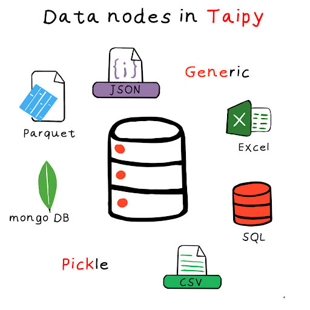

> You can download the code for
<a href="./../src/step_03.py" download>Step 2</a> 
or all the steps <a href="./../src/src.zip" download>here</a>. 

# Data Node types

*Estimated Time for Completion: 15 minutes; Difficulty Level: Beginner*

{ width=700 style="margin:auto;display:block;border: 4px solid rgb(210,210,210);border-radius:7px" }

- *[Pickle](../../../../manuals/core/config/data-node-config.md/#pickle)* (default): Taipy can read and write any data that can be serializable.

- *[CSV](../../../../manuals/core/config/data-node-config.md/#csv)*: Taipy can read and write any data frame as a CSV.

- *[JSON](../../../../manuals/core/config/data-node-config.md/#json)*: Taipy can read and write any JSONable data as a JSON file.

- *[SQL](../../../../manuals/core/config/data-node-config.md/#sql)*: Taipy can read and write from/to a SQL table or a SQL database.

- *[Mongo](../../../../manuals/core/config/data-node-config.md/#mongo-collection)*: Taipy can read and write from/to a Mongo Collection

- *[Parquet](../../../../manuals/core/config/data-node-config.md/#parquet)*: Taipy can read and write data frames from/to a Parquet format

- *[Generic](../../../../manuals/core/config/data-node-config.md/#generic)*: Taipy provides a generic Data Node that can read and store any data based on a custom _reading_ and _writing_ function created by the user.

This part utilizes the straightforward DAG/execution setup detailed below. The setup comprises the following components:

1. Three Data Nodes:

_historical data_: This is a CSV-type Data Node. It reads from a CSV file into the initial data frame. You can find the dataset used in the Getting Started 
<a href="./../src/daily-min-temperatures.csv" download>here</a>.

_month_data_: It stores the data frame generated by the task '_filter_' (stored as a Pickle).

_nb_of_values_: It stores an integer generated by the '_count_values_' task (stored as a Pickle).  

2. Two tasks linking these Data Nodes:

_filter_: filters on the current month of the data frame

_count_values_: calculates the number of elements in this month


{ width=700 style="margin:auto;display:block;border: 4px solid rgb(210,210,210);border-radius:7px" }

```python
def filter_current(df):
    current_month = dt.datetime.now().month
    df['Date'] = pd.to_datetime(df['Date']) 
    df = df[df['Date'].dt.month == current_month]
    return df

def count_values(df):
    return len(df)
```

!!! example "Configuration"

    === "Taipy Studio"

        { width=700 style="margin:auto;display:block;border: 4px solid rgb(210,210,210);border-radius:7px" }

        To use this configuration in our code (`main.py` for example), we must load it and retrieve the `scenario_cfg`. This `scenario_cfg` is the basis to instantiate our scenarios. You can retrieve it or take it [here](../src/config_05.toml).

        ```python
        Config.load('config_03.toml')

        # my_scenario is the id of the scenario configured
        scenario_cfg = Config.scenarios['my_scenario']
        ```

    === "Python configuration"

        ```python
        # here is a CSV Data Node
        historical_data_cfg = Config.configure_csv_data_node(id="historical_data",
                                                             default_path="time_series.csv")
        month_values_cfg =  Config.configure_data_node(id="month_data")
        nb_of_values_cfg = Config.configure_data_node(id="nb_of_values")
        ```


        ```python
        task_filter_cfg = Config.configure_task(id="filter_current",
                                                         function=filter_current,
                                                         input=historical_data_cfg,
                                                         output=month_values_cfg)

        task_count_values_cfg = Config.configure_task(id="count_values",
                                                         function=count_values,
                                                         input=month_values_cfg,
                                                         output=nb_of_values_cfg)
        ```


        ```python
        scenario_cfg = Config.configure_scenario(id="my_scenario",
                                                            task_configs=[task_filter_cfg,
                                                             task_count_values_cfg])

        ```

Here is some code to showcase the scenario creation and submission.

```python
tp.Core().run()

scenario = tp.create_scenario(scenario_cfg, creation_date=dt.datetime(2022,10,7), name="Scenario 2022/10/7")
scenario.submit()

print("Nb of values of scenario:", scenario.nb_of_values.read())

data_node = None

tp.Gui("""<|{scenario}|scenario_selector|>
          <|{scenario}|scenario|>
          <|{scenario}|scenario_dag|>
          <|{data_node}|data_node_selector|>""").run()
```

Results:

```
[2022-12-22 16:20:03,424][Taipy][INFO] job JOB_filter_current_... is completed.
[2022-12-22 16:20:03,510][Taipy][INFO] job JOB_count_values_... is completed.
    
Nb of values of scenario: 896
```
