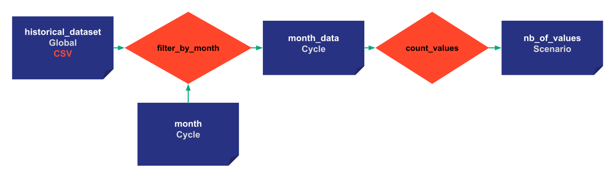
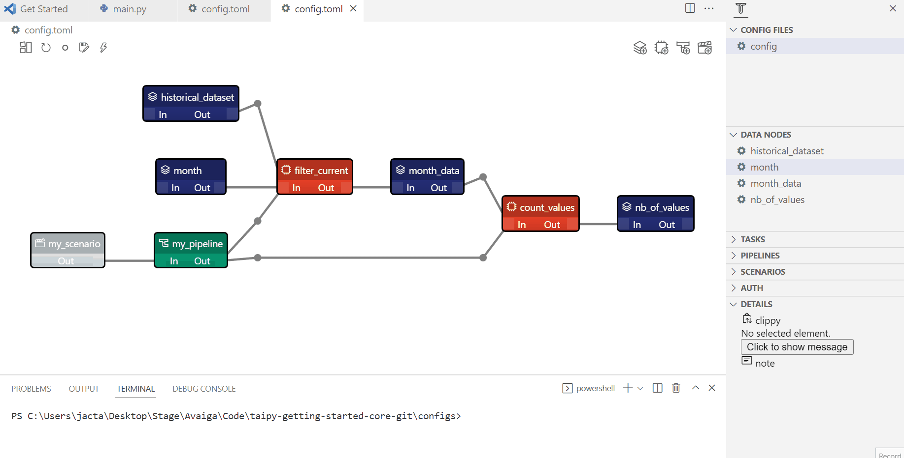

> You can download the code of this step [here](../src/step_05.py) or all the steps [here](https://github.com/Avaiga/taipy-getting-started-core/tree/develop/src).

# Step 5: Scopes

[Scopes](https://docs.taipy.io/en/latest/manuals/core/concepts/scope/) determine how Data Nodes are shared between cycles, scenarios, and pipelines. The developer may decide to:

- Keep Data Nodes local to each pipeline.

- Extend the scope by sharing data nodes between a given scenario's pipelines.

- Extend the scope by sharing data nodes across all scenarios of a given cycle.

- Finally, extend the scope globally (across all scenarios of all cycles). For example, the initial/historical dataset is usually shared by all the scenarios/pipelines/cycles. It has a Global Scope and will be unique in the entire application.

To summarize, the different possible scopes are:

- _Pipeline scope_: two pipelines can reference different Data Nodes even if their names are the same. For example, we can have a _prediction_ Data Node of an ARIMA model (ARIMA pipeline) and a _prediction_ Data Node of a RandomForest model (RandomForest pipeline). A scenario can contain multiple pipelines.

- _Scenario scope (default)_: pipelines share the same Data Node within a scenario. 

- _Cycle scope_: scenarios from the same Cycle share the same Data Node.

- _Global scope_: Data Nodes are shared across all the scenarios/pipelines/cycles.

It is worth noting that the default scope for Data nodes is the Scenario scope.

{ width=700 style="margin:auto;display:block;border: 4px solid rgb(210,210,210);border-radius:7px" }

!!! example "Configuration"

    === "Taipy Studio"

        Modifying the scope of a Data Node is as simple as changing its Scope parameter in the configuration. 

        The configuration is taken in the previous step, so you can copy the last TOML Config file directly.

        { width=700 style="margin:auto;display:block;border: 4px solid rgb(210,210,210);border-radius:7px" }

        - Change the Scope of historical_data to be global
        
            - name: historical_data
                
            - Details: default_path=xxxx/yyyy.csv, storage_type=csv, scope=GLOBAL:SCOPE
                
        - Change the Scope of month_data and month to be Cycle
        
            - name: output
                
            - Details: storage_type:pickle, scope=CYCLE:SCOPE
                
        - Load the new configuration in the code

    === "Python configuration"

        Modifying the scope of a Data Node is as simple as changing its Scope parameter inside the configuration.

        The configuration is taken in the previous step so you can copy the previous code directly.

        ```python
        from taipy.config import Scope, Frequency

        historical_data_cfg = Config.configure_csv_data_node(id="historical_data",
                                                         default_path="time_series.csv",
                                                         scope=Scope.GLOBAL)
        month_cfg =  Config.configure_data_node(id="month", scope=Scope.CYCLE)

        month_values_cfg = Config.configure_data_node(id="month_data",
                                                       scope=Scope.CYCLE)
        ```


Cycles are created based on the _creation_date_ of scenarios. In the example below, we force the creation_date to a given date (in real life, the actual creation date of the scenario gets used automatically).

```python
tp.Core().run()

scenario_1 = tp.create_scenario(scenario_cfg,
                                creation_date=dt.datetime(2022,10,7),
                                name="Scenario 2022/10/7")
scenario_2 = tp.create_scenario(scenario_cfg,
                               creation_date=dt.datetime(2022,10,5),
                               name="Scenario 2022/10/5")
scenario_3 = tp.create_scenario(scenario_cfg,
                                creation_date=dt.datetime(2021,9,1),
                                name="Scenario 2021/9/1")
```

Scenario 1 and 2 belong to the same Cycle: since _month_ now has a **Cycle** scope, we can define _month_ just once for both scenarios: 1 and 2.


```python
scenario_1.month.write(10)
scenario_3.month.write(9)
print("Scenario 1: month", scenario_1.month.read())
print("Scenario 2: month", scenario_2.month.read())
print("Scenario 3: month", scenario_2.month.read())
```
Results:
```
Scenario 1: month 10
Scenario 2: month 10
Scenario 3: month 9
```

Defining the _month_ of scenario 1 will also determine the _month_ of scenario 2 since they share the same Data Node. 

This is not the case for _nb_of_values_ that are of Scenario scope; each _nb_of_values_ has its own value in each scenario.
