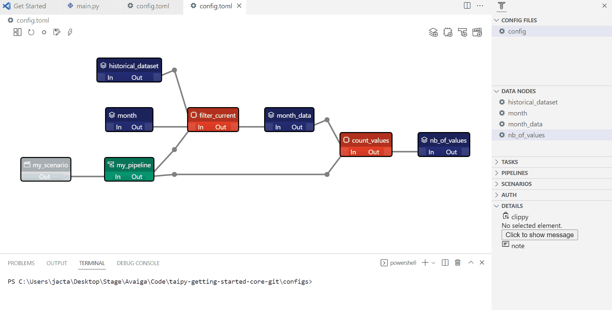

> You can download the code for
<a href="./../src/step_06.py" download>Step 6</a> 
or all the steps <a href="./../src/src.zip" download>here</a>. 

# Skipping tasks

*Estimated Time for Completion: 15 minutes; Difficulty Level: Intermediate*

Skipping tasks is a crucial capability of Taipy. If you run a function twice with the same inputs, you'll get the same output. Executing this type of function is inefficient and consumes unnecessary time and resources.

Taipy offers the option to set the _skippable_ attribute for each task. If this attribute is set to True, Taipy Core’s scheduler automatically detects if changes have occurred on any of the input Data Nodes of a task. 
If there are no changes, it automatically skips the execution of that task. By default, _skippable_ is set to False. 


{ width=700 style="margin:auto;display:block;border: 4px solid rgb(210,210,210);border-radius:7px" }

!!! example "Configuration"

    === "Taipy Studio"

        { width=700 style="margin:auto;display:block;border: 4px solid rgb(210,210,210);border-radius:7px" }

        - Add _skippable_ to the tasks

        ```python
        Config.load('config_06.toml')

        # my_scenario is the id of the scenario configured
        scenario_cfg = Config.scenarios['my_scenario']
        ```

    === "Python configuration"

        The configuration is almost the same. `skippable=True` are added to the tasks we want to be skipped.

        ```python
        task_filter_cfg = Config.configure_task(id="filter_by_month",
                                                     function=filter_by_month,
                                                     input=[historical_data_cfg, month_cfg],
                                                     output=month_values_cfg,
                                                     skippable=True)

        task_count_values_cfg = Config.configure_task(id="count_values",
                                                         function=count_values,
                                                         input=month_values_cfg,
                                                         output=nb_of_values_cfg,
                                                         skippable=True)
        ```

Here we create three different scenarios with different creation dates and names. Scenario 1 and scenario 2 belong to the same cycle.

```python
tp.Core().run()

scenario_1 = tp.create_scenario(scenario_cfg,
                                creation_date=dt.datetime(2022,10,7),
                                name="Scenario 2022/10/7")
scenario_2 = tp.create_scenario(scenario_cfg,
                               creation_date=dt.datetime(2022,10,5),
                               name="Scenario 2022/10/5")
scenario_3 = tp.create_scenario(scenario_cfg,
                                creation_date=dt.datetime(2021,9,1),
                                name="Scenario 2022/9/1")

scenario_1.month.write(10)
```

Here, the scenario 1 is submitted.

```python
print("Scenario 1: submit")
scenario_1.submit()
print("Value", scenario_1.nb_of_values.read())
```

Results:

```
Scenario 1: submit
[2022-12-22 16:20:09,079][Taipy][INFO] job JOB_filter_by_month_... is completed.
[2022-12-22 16:20:09,177][Taipy][INFO] job JOB_count_values_... is completed.
Value 849
```

When you submit scenario 2, the scheduler skips the initial task in this second scenario. This is because both scenarios use the same Data Nodes for this task, and there have been no changes in the input Data Nodes since the last time the task ran when we submitted scenario 1.

```python
# the first task has already been executed by scenario 1
print("Scenario 2: first submit")
scenario_2.submit()
print("Value", scenario_2.nb_of_values.read())
```

Results:
```
Scenario 2: first submit
[2022-12-22 16:20:09,317][Taipy][INFO] job JOB_filter_by_month_... is skipped.
[2022-12-22 16:20:09,371][Taipy][INFO] job JOB_count_values_... is completed.
Value 849
```

Resubmitting the same scenario without any change skips every task.

```python
print("Scenario 2: second submit")
scenario_2.submit()
print("Value", scenario_2.nb_of_values.read())
```

Results:
```
Scenario 2: second submit
[2022-12-22 16:20:09,516][Taipy][INFO] job JOB_filter_by_month_... is skipped.
[2022-12-22 16:20:09,546][Taipy][INFO] job JOB_count_values_... is skipped.
Value 849
```

Scenario 3 is not in the same cycle. The scheduler completes every task. 

```python
scenario_3.month.write(9)
scenario_3.submit()
```

Results:
```
[2022-12-22 16:20:10,071][Taipy][INFO] job JOB_filter_by_month_... is completed.
[2022-12-22 16:20:10,257][Taipy][INFO] job JOB_count_values_... is completed.
```  

Here, we change the input Data Node of the pipeline so Taipy will re-run the correct tasks to ensure that everything is up-to-date.


```python
# changing an input data node will make the task be executed
print("Scenario 3: change in historical data")
scenario_3.historical_data.write(pd.read_csv('time_series_2.csv'))
scenario_3.submit()
```

Results:

```
Scenario 3: change in historical data
[2022-12-22 16:20:10,870][Taipy][INFO] job JOB_filter_by_month_... is completed.
[2022-12-22 16:20:10,932][Taipy][INFO] job JOB_count_values_... is completed.
```
