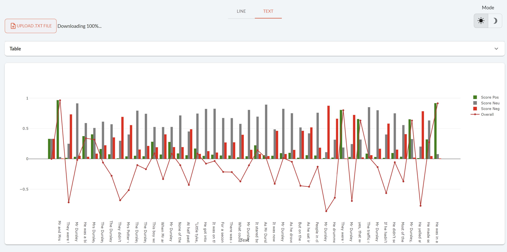

!!! important "Supported Python versions"

    Taipy requires **Python 3.8** or newer.

Welcome to the **Tutorial** on how to use Taipy frontend. This tour shows you how to use Taipy to create an interactive Web application.

{ width=700 style="margin:auto;display:block;border: 4px solid rgb(210,210,210);border-radius:7px" }

Taipy aims to simplify web application development:

- Accelerates application building.

- Streamlines management of variables and events.

- Offers intuitive visualization using Markdown syntax.

Each step of the **"Tutorial"** will focus on the basic concepts of *Taipy*. Note that every step is dependent on the code of the previous one. After completing the last step, you will have the skills to develop your own Taipy 
application. 

## Before we begin

**Taipy** package requires Python 3.8 or newer;

``` console
$ pip install taipy
```

After completing step 5, the application will feature a Natural Language Processing (NLP) algorithm for demonstration purposes, compatible only with Python versions 3.8 to 3.10. To integrate this NLP feature, you must install Transformers and Torch. Nonetheless, you can still continue with the tutorial guide by choosing to skip this algorithm.

``` console
$ pip install torch
$ pip install transformers
```

!!! info 

    `pip install taipy` is the preferred method to install the latest stable version of Taipy.
    
    If you don't have [pip](https://pip.pypa.io) installed, this 
    [Python installation guide](http://docs.python-guide.org/en/latest/starting/installation/)
    can guide you through the process.

## Using Notebooks

This **Tutorial** is for Python scripts (*.py*) only. If you want to use **Jupyter Notebooks**, download this [notebook](../../../../getting_started/getting-started-gui/getting_started.ipynb).

## Taipy Studio

[Taipy Studio](../../../manuals/studio/index.md) is a VS Code extension that provides an auto-completion of Taipy visual elements. Creating a Taipy application can be done more easily and quickly through Taipy Studio.

So, without further delay, let's begin to code!

## Steps

1. [First Web page](step_01/step_01.md)

2. [Visual elements](step_02/step_02.md)

3. [Interaction](step_03/step_03.md)

4. [Charts](step_04/step_04.md)

5. [Python expression in properties](step_05/step_05.md)

6. [Page layout](step_06/step_06.md)

7. [Multi-pages, navbars, and menus](step_07/step_07.md)
