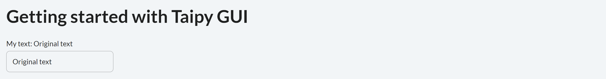

> You can download the code of this step [here](../src/step_02.py) or all the steps [here](https://github.com/Avaiga/taipy-getting-started-gui/tree/develop/src).

!!! warning "For Notebooks"

    The "Getting Started" Notebook is available [here](https://docs.taipy.io/en/latest/getting_started/getting-started-gui/getting_started.ipynb). In Taipy GUI, the process to execute a Jupyter Notebook is different from executing a Python Script.

# Step 2: Visual elements

Many visual elements can be added to the basic code viewed in Step 1. This Step shows how to use visual elements 
like charts, sliders, tables, etc., inside the graphical interface.

## Visual elements

Taipy GUI can be considered as an **augmented** Markdown; it adds the concept of 
**[Visual elements](https://docs.taipy.io/en/latest/manuals/gui/viselements/)** on top of all the Markdown syntax. A visual 
element is a Taipy graphical object displayed on the client. It can be a 
[slider](https://docs.taipy.io/en/latest/manuals/gui/viselements/slider/), a 
[chart](https://docs.taipy.io/en/latest/manuals/gui/viselements/chart/), a 
[table](https://docs.taipy.io/en/latest/manuals/gui/viselements/table/), an 
[input](https://docs.taipy.io/en/latest/manuals/gui/viselements/input/), a 
[menu](https://docs.taipy.io/en/latest/manuals/gui/viselements/menu/), etc. Check the list 
[here]( https://docs.taipy.io/en/latest/manuals/gui/viselements/controls/).

Every visual element follows a similar syntax:

`<|{variable}|visual_element_name|param_1=param_1|param_2=param_2| ... |>`.

For example, a [slider](https://docs.taipy.io/en/latest/manuals/gui/viselements/slider/) is written this way :

`<|{variable}|slider|min=min_value|max=max_value|>`.

For each visual element you wish to add to your web page, you must include the above-mentioned syntax inside your markdown 
string (representing your page). Example: at the beginning of the page, let's display:

- a Python variable *text*

- an input that will "visually" modify the value of __text__.

Here is the overall syntax:

```
<|{text}|>
<|{text}|input|>
```

Here is the combined code:

```python
from taipy.gui import Gui

text = "Original text"

page = """
# Getting started with Taipy GUI

My text: <|{text}|>

<|{text}|input|>
"""

Gui(page).run()
```

{ width=700 style="margin:auto;display:block;border: 4px solid rgb(210,210,210);border-radius:7px" }
