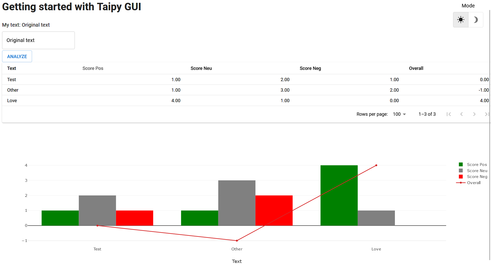

> You can download the code of this step [here](../src/step_04.py) or all the steps [here](https://github.com/Avaiga/taipy-getting-started-gui/tree/develop/src).

!!! warning "For Notebooks"

    The "Getting Started" Notebook is available [here](https://docs.taipy.io/en/latest/getting_started/getting-started-gui/getting_started.ipynb). In Taipy GUI, the process to execute a Jupyter Notebook is different from executing a Python Script.

# Step 4: Charts
 
Charts are an essential part of Taipy (and of any Web application!). A chart is just another visual element with many properties to customize it.

Here is one of the simplest code to create a chart:

```python
list_to_display = [100/x for x in range(1, 100)]
"<|{list_to_display}|chart|>"
```

Different formats can be passed to a chart element: a list, a Numpy array, or a Pandas Dataframe.

## Different useful properties

Taipy charts are based on Plotly charts. Like any other visual element, charts have a lot of parameters.

Here are a few of the essential properties. You can also look at the [documentation]() for more information.
 - x and y are used to define the axis of the chart. Note that even if data inside columns are dynamic, the name of columns to display in a chart are not.

```python
data = pd.DataFrame({"x_col":[0,1,2], "y_col1":[4,1,2]})
Gui("<|{data}|chart|x=x_col|y=y_col1|>").run()
```

 - x and y can be indexed to add more traces to the chart:

```python
data = pd.DataFrame({"x_col":[0,1,2], "y_col_1":[4,2,1], "y_col_2":[3,1,2]})
Gui("<|{data}|chart|x=x_col|y[1]=y_col_1|y[2]=y_col_2|>").run()
```

 - Taipy provides a lot of different options to customize graphs. _color_ is one of them:

```python
data = pd.DataFrame({"x_col":[0,1,2], "y_col_1":[4,2,1], "y_col_2":[3,1,2]})
Gui("<|{data}|chart|x=x_col|y[1]=y_col_1|y[2]=y_col_2|color[1]=green|>").run()
```

## Different types of charts

Different types are available: maps, bar charts, pie charts, line charts, and 3D charts, ... To know how to use them quickly, types are listed [here](). If compatible, two types like _scatter_, _line_, and _bar_ can also be used together on the same chart. 

```python
data = pd.DataFrame({"x_col":[0,1,2], "y_col_1":[4,1,2], "y_col_2":[3,1,2]})
Gui("<|{data}|chart|x=x_col|y[1]=y_col_1|y[2]=y_col_2|type[1]=bar|>").run()
```

## Code

A chart is added to our code to visualize the score given by our NLP algorithm to different lines.

```python

page = """
... put the previous Markdown page here

<|{dataframe}|table|>

<|{dataframe}|chart|type=bar|x=Text|y[1]=Score Pos|y[2]=Score Neu|y[3]=Score Neg|y[4]=Overall|color[1]=green|color[2]=grey|color[3]=red|type[4]=line|>
"""


dataframe = pd.DataFrame({"Text":['Test', 'Other', 'Love'],
                          "Score Pos":[1, 1, 4],
                          "Score Neu":[2, 3, 1],
                          "Score Neg":[1, 2, 0],
                          "Overall":[0, -1, 4]})

```

## Quick tip to write visual elements

To simplify the coding, each visual element has a "properties" parameter where a Python dictionary of property can be directly passed on. To replicate the graph above, we could do the following:

```python
property_chart = {"type":"bar",
                  "x":"Text",
                  "y[1]":"Score Pos",
                  "y[2]":"Score Neu",
                  "y[3]":"Score Neg",
                  "y[4]":"Overall",
                  "color[1]":"green",
                  "color[2]":"grey",
                  "color[3]":"red",
                  "type[4]":"line"
                 }

page = """
...
<|{dataframe}|chart|properties={property_chart}|>
...
"""

```


{ width=700 style="margin:auto;display:block;border: 4px solid rgb(210,210,210);border-radius:7px" }
