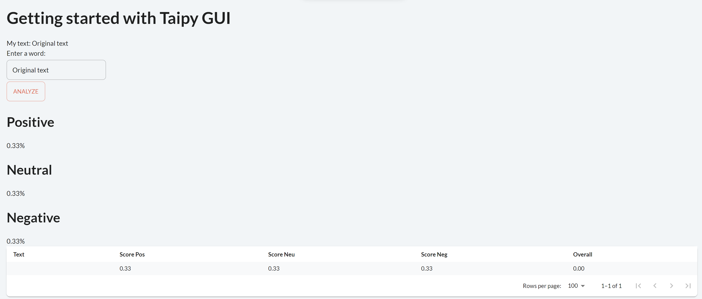

> You can download the code of this step [here](../src/step_05.py) or all the steps [here](https://github.com/Avaiga/taipy-getting-started-gui/tree/develop/src).

!!! warning "For Notebooks"

    The "Getting Started" Notebook is available [here](https://docs.taipy.io/en/latest/getting_started/getting-started-gui/getting_started.ipynb). In Taipy GUI, the process to execute a Jupyter Notebook is different from executing a Python Script.

# Step 5: Python expression in properties

As shown before, parameters and variables in Taipy are dynamic. The same applies for every type of object, even data frames. Therefore, you can perform operations on data frames, and Taipy GUI will show real-time results on the GUI. These changes occur through the `=` assignment like `state.xxx = yyy` (`state.text = "Example"`).

Any expression containing `xxx` in the Markdown will propagate the changes and reload related elements. It can be  simple charts or tables, but it can also be an expression like this:

```python
"""
## Positive
<|{np.mean(dataframe['Score Pos'])}|text|>

## Neutral
<|{np.mean(dataframe['Score Neu'])}|text|>

## Negative
<|{np.mean(dataframe['Score Neg'])}|text|>
"""
```

This kind of expression creates direct connections between visual elements without coding anything.


## A use case for NLP - Part 1

The code for NLP is provided here; it doesn't concern Taipy but it will be used in Part 2 when we wrap a GUI around this NLP engine. Before executing this step, you should have `pip install torch` and `pip install transformers`. The model will be downloaded and used in this code snippet. Torch is for now only available for Python version between 3.8 and 3.10. If you cannot install these packages, just return a dictionnary of random numbers for the `analyze_text(text)`.


```python
from transformers import AutoTokenizer
from transformers import AutoModelForSequenceClassification
from scipy.special import softmax


MODEL = f"cardiffnlp/twitter-roberta-base-sentiment"
tokenizer = AutoTokenizer.from_pretrained(MODEL)
model = AutoModelForSequenceClassification.from_pretrained(MODEL)


def analyze_text(text):
    # Run for Roberta Model
    encoded_text = tokenizer(text, return_tensors='pt')
    output = model(**encoded_text)
    scores = output[0][0].detach().numpy()
    scores = softmax(scores)
    
    return {"Text":text,
            "Score Pos":scores[2],
            "Score Neu":scores[1],
            "Score Neg":scores[0],
            "Overall":scores[2]-scores[0]}

```


## A use case for NLP - Part 2

The code below uses this concept to create metrics on the data frame generated. 


```python     
import numpy as np
import pandas as pd 
from taipy.gui import Gui, notify

text = "Original text"

dataframe = pd.DataFrame({"Text":[''],
                          "Score Pos":[0.33],
                          "Score Neu":[0.33],
                          "Score Neg":[0.33],
                          "Overall":[0]})


def local_callback(state):
    notify(state, 'Info', f'The text is: {state.text}', True)
    temp = state.dataframe.copy()
    scores = analyze_text(state.text)
    temp.loc[len(temp)] = scores
    state.dataframe = temp
    state.text = ""


page = """
<|toggle|theme|>

# Getting started with Taipy GUI

My text: <|{text}|>

Enter a word:
<|{text}|input|>
<|Analyze|button|on_action=local_callback|>

## Positive
<|{np.mean(dataframe['Score Pos'])}|text|format=%.2f|>

## Neutral
<|{np.mean(dataframe['Score Neu'])}|text|format=%.2f|>

## Negative
<|{np.mean(dataframe['Score Neg'])}|text|format=%.2f|>

<|{dataframe}|table|>

<|{dataframe}|chart|type=bar|x=Text|y[1]=Score Pos|y[2]=Score Neu|y[3]=Score Neg|y[4]=Overall|color[1]=green|color[2]=grey|color[3]=red|type[4]=line|>
"""

Gui(page).run()
```


{ width=700 style="margin:auto;display:block;border: 4px solid rgb(210,210,210);border-radius:7px" }
