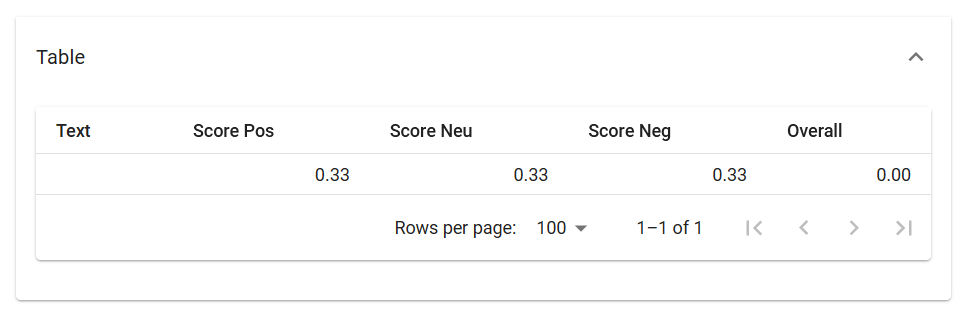
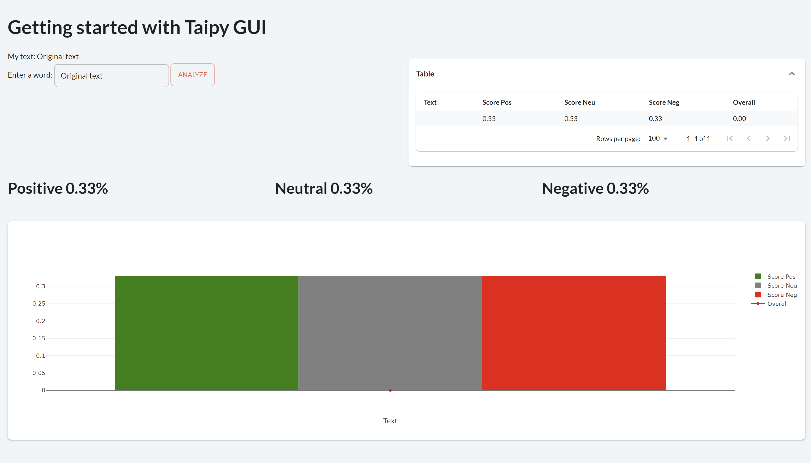

> You can download the code of this step [here](../src/step_06.py) or all the steps [here](https://github.com/Avaiga/taipy-getting-started-gui/tree/develop/src).

!!! warning "For Notebooks"

    The "Getting Started" Notebook is available [here](https://docs.taipy.io/en/latest/getting_started/getting_started.ipynb). In Taipy GUI, the process to execute a Jupyter Notebook is different from executing a Python Script.
    It is important to check the [Notebook](https://docs.taipy.io/en/latest/getting_started/getting_started.ipynb) content and see the [documentation](https://docs.taipy.io/en/latest/manuals/gui/notebooks/).

# Step 6: Page layout

You have created a full forecasting application that predicts across multiple days with different parameters in just a few steps. However, the page's layout could be greatly improved. Three new useful controls will be used to get a more aesthetically pleasing page. These are:

- [part](https://docs.taipy.io/en/latest/manuals/gui/viselements/part/): creates a group of text/visual elements. A useful property of `part` is _render_. If set to False, it will not display the part. This allows the developer to hide a group of visual elements dynamically.

```
<|part|render={bool_variable}|
Text
Or visual elements...
|>
```

- [layout](https://docs.taipy.io/en/latest/manuals/gui/viselements/layout/): creates invisible columns where you can put your texts and visual elements. The _columns_ property indicates the width and number of columns. Here, we create three columns of the same width.

```
<|layout|columns=1 1 1|
Button in first column <|Press|button|>

Second column

Third column
|>
```

{ width=500 style="margin:auto;display:block;border: 4px solid rgb(210,210,210);border-radius:7px" }


- [expandable](https://docs.taipy.io/en/latest/manuals/gui/viselements/expandable/): creates a block that can expand or shrink.

{ width=500 style="margin:auto;display:block;border: 4px solid rgb(210,210,210);border-radius:7px" }


## Back to the code

```python

page = """
<|toggle|theme|>

# Getting started with Taipy GUI

<|layout|columns=1 1|
<|
My text: <|{text}|>

Enter a word:
<|{text}|input|>
<|Analyze|button|on_action=local_callback|>
|>


<|Table|expandable|
<|{dataframe}|table|width=100%|>
|>
|>

<|layout|columns=1 1 1|
## Positive <|{np.mean(dataframe['Score Pos'])}|text|format=%.2f|raw|>

## Neutral <|{np.mean(dataframe['Score Neu'])}|text|format=%.2f|raw|>

## Negative <|{np.mean(dataframe['Score Neg'])}|text|format=%.2f|raw|>
|>

<|{dataframe}|chart|type=bar|x=Text|y[1]=Score Pos|y[2]=Score Neu|y[3]=Score Neg|y[4]=Overall|color[1]=green|color[2]=grey|color[3]=red|type[4]=line|>
"""
```

{ width=700 style="margin:auto;display:block;border: 4px solid rgb(210,210,210);border-radius:7px" }

