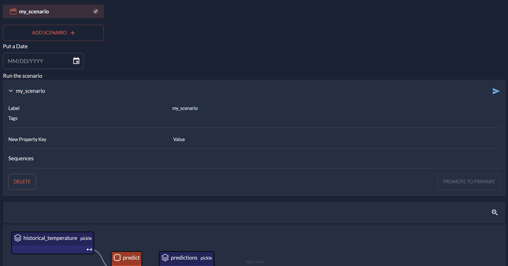

*Estimated Time for Completion: 15 minutes; Difficulty Level: Beginner*

Taipy brings a suite of features to streamline data pipeline orchestration:

- It registers each pipeline execution, enabling users to monitor KPIs over time 
and benchmark different runs, providing *what-if* scenarios.
- Taipy includes ready-to-use UI components for pipeline interaction—allowing for the 
selection of inputs and parameters, execution and tracking of pipelines, and 
visualization of results.
- Taipy efficiently manages computations, avoiding unnecessary reruns of unchanged data.
- Taipy easily integrates with most popular data sources.
- It supports concurrent computing, enhancing processing speed and scalability.

[Download the code](./src/scenario_management.zip){: .tp-btn target='blank' }

By the end of this tutorial, you'll have a solid foundation to develop a simple 
application leveraging Taipy's scenario management capabilities.

{ width=90% : .tp-image-border }

Before looking at some code examples, to apprehend what is a *Scenario*, you need to
understand the *Data node* and *Task* concepts.

- [**Data Nodes**](../../../manuals/core/concepts/data-node.md): represents a variable in Taipy.
Data Nodes don't contain the data itself but point to the data and know
  how to retrieve it. These Data Nodes can point to different types of data sources like CSV
  files, Pickle files, databases, etc., and they can represent various types of Python variables
  such as integers, strings, data frames, lists, and more. They are fully generic and can be
  used to represent datasets, parameters, KPIs, intermediate data, or any variable.

- [**Tasks**](../../../manuals/core/concepts/task.md): are the translation of functions in
  Taipy where their inputs and outputs are data nodes.

- [**Scenarios**](../../../manuals/core/concepts/scenario.md): Scenarios are created by
  combining Data Nodes and Tasks to form a graph that maps the execution flow. Each scenario can be
  submitted, resulting in the execution of its tasks.
  End-Users very often require modifying various parameters to reflect different business
  situations. Taipy provide the framework to execute various scenarios under different
  situations (i.e. various data/parameters values set by end-users).

[**Configuration**](../../../manuals/core/config/index.md) is a structure to define scenarios.
It serves as the blueprint for our Directed Acyclic Graph(s) and models the data sources,
parameters, and tasks. After being defined, a configuration functions like a superclass and is
employed to generate various instances of scenarios.

# Configuring a Scenario

First, we'll import the necessary libraries and load a dataset:

```python
from taipy import Config
import taipy as tp
import pandas as pd
import datetime as dt


data = pd.read_csv("https://raw.githubusercontent.com/Avaiga/taipy-getting-started-core/develop/src/daily-min-temperatures.csv")
```

Think about the most basic pipeline: one function that needs two things to work – some data and a
date. It uses these to generate a prediction for that date.

See the code for this function below:

```python
def predict(historical_temperature: pd.DataFrame, date_to_forecast: dt.datetime) -> float:
    print(f"Running baseline...")
    historical_temperature['Date'] = pd.to_datetime(historical_temperature['Date'])
    historical_same_day = historical_temperature.loc[
        (historical_temperature['Date'].dt.day == date_to_forecast.day) &
        (historical_temperature['Date'].dt.month == date_to_forecast.month)
    ]
    return historical_same_day['Temp'].mean()
```
The scenario can be represented as the following graph:

{ width=80% : .tp-image }

Three Data Nodes are being configured (**historical_temperature**, **date_to_forecast** and
**predictions**). The task **predict** links the three Data Nodes through the Python function.

!!! example "Configuration"

    === "Python configuration"

        **Alternative 1:** Configuration using Python Code

        Here is the code to configure a simple scenario.

        ```python
        # Configuration of Data Nodes
        historical_temperature_cfg = Config.configure_data_node("historical_temperature")
        date_to_forecast_cfg = Config.configure_data_node("date_to_forecast")
        predictions_cfg = Config.configure_data_node("predictions")

        # Configuration of tasks
        task_predict_cfg = Config.configure_task(id="predict",
                                            function=predict,
                                            input=[historical_temperature_cfg, date_to_forecast_cfg],
                                            output=predictions_cfg)

        # Configuration of scenario
        scenario_cfg = Config.configure_scenario(id="my_scenario",
                                                 task_configs=[task_predict_cfg])
        ```

    === "Using Taipy Studio"

        **Alternative 2:** Configuration using Taipy Studio

        By watching the animation below, you can see how this configuration gets created using
        Taipy Studio. In fact, Taipy Studio is an editor of a TOML file specific to Taipy. It
        lets you edit and view a TOML file that will be used in our code.

        <video controls width="400">
            <source src="./images/config.mp4" type="video/mp4">
        </video>

        To use this configuration in our code (`main.py` for example), we must load it and
        retrieve the *scenario_cfg* instance. This object is the basis to instantiate our
        scenarios.

        ```python
        Config.load('config.toml')

        # my_scenario is the id of the scenario configured
        scenario_cfg = Config.scenarios['my_scenario']
        ```

The configuration is done! Let's use it to instantiate scenarios and submit them.

# Instantiate Scenario

First, run the Core service in your code (`tp.Core().run()`). Then, you can play with Taipy:

- create scenarios ([`tp.create_scenario(<ScenarioConfig>)`](../../scenario_management/1_scenarios.md#scenario-configuration-and-creation)),

- write your input data nodes ([`<Data Node>.write(<new value>)`](../../../manuals/core/entities/data-node-mgt.md#read-write-a-data-node)),

- submit them to run the task ([`<Scenario>.submit()`](../../scenario_management/1_scenarios.md#scenario-configuration-and-creation)),

- read your output data node ([`<Data Node>.read()`](../../../manuals/core/entities/data-node-mgt.md#read-write-a-data-node)).

Creating a scenario creates all its related entities (**tasks**, **Data Nodes**, etc). 
These entities are being created thanks to the previous
configuration. Still, no scenario has been run yet. `tp.submit(<Scenario>)` is the line of code
that triggers the run of all the scenario-related tasks.

```python
# Run of the Core
tp.Core().run()

# Creation of the scenario and execution
scenario = tp.create_scenario(scenario_cfg)
scenario.historical_temperature.write(data)
scenario.date_to_forecast.write(dt.datetime.now())
tp.submit(scenario)

print("Value at the end of task", scenario.predictions.read())
```

Results:

```
[2022-12-22 16:20:02,740][Taipy][INFO] job JOB_predict_... is completed.
Value at the end of task 23.45
```

In this code, you can see how to create and submit scenarios, retrieve data nodes,
read and write data. 

!!! note "Some useful functions"

    As a quick note, here are some other basic functions to use for data and scenario managament.

    - [`tp.get_scenarios()`](../../../manuals/core/entities/scenario-cycle-mgt.md/#get-all-scenarios): this function returns the list of all the scenarios.


    For instance, the following Python code retrieves all the scenarios, extracts their names, 
    and pairs them with their respective predictions. The names and predictions are then 
    compiled into a list:

    ```python
    print([(s.name, s.predictions.read()) for s in tp.get_scenarios()])
    ```

    - [`tp.get(<Taipy object ID>)`](../../../manuals/core/entities/data-node-mgt.md#get-data-node): this function returns an entity based on the id of the entity.

    - [`tp.delete(<Taipy object ID>)`](../../../manuals/core/entities/scenario-cycle-mgt.md#delete-a-scenario): this function deletes the entity and nested elements based on the id of the entity.

    You can also have a look to this [tutorial](../../scenario_management/6_scenario_comparison/index.md) 
    to learn how scenarios can be compared easily. 
    Many other functions are described in the manuals, in particular in the
    [scenario](../../../manuals/core/entities/scenario-cycle-mgt.md) 
    and
    [data node](../../../manuals/core/entities/data-node-mgt.md) 
    documentation pages.

# Visual elements

The small piece of code of the previous section shows how to manage scenarios. The scenario or data
node management is usually done by end-users through a graphical interface. Taipy provides
visual elements dedicated to Scenario management to replace the code above.

Add these few lines to the code of your script. This creates a web application, so end-users can:

- select scenarios,

- create new ones,

- submit them,

- access their properties.

```python
def save(state):
    # write values of Data Node to submit scenario
    state.scenario.historical_temperature.write(data)
    state.scenario.date_to_forecast.write(state.date)
    state.refresh('scenario')
    tp.gui.notify(state, "s", "Saved! Ready to submit")

date = None
scenario_md = """
<|{scenario}|scenario_selector|>

Select a Date
<|{date}|date|on_change=save|active={scenario}|>

Run the scenario
<|{scenario}|scenario|>
<|{scenario}|scenario_dag|>

View all the information on your prediction here
<|{scenario.predictions}|data_node|>
"""

tp.Gui(scenario_md).run()
```

The
[Scenario management controls](../../../manuals/gui/viselements/controls.md#scenario-management-controls)
provide all the necessary features to access and manage scenarios and data nodes. In fact,
creating a Scenario based application connected to your pipelines has never been simpler.

{ width=90% : .tp-image-border }

# Entire code

```python
from taipy import Config
import taipy as tp
import pandas as pd
import datetime as dt


data = pd.read_csv("https://raw.githubusercontent.com/Avaiga/taipy-getting-started-core/develop/src/daily-min-temperatures.csv")


# Normal function used by Taipy
def predict(historical_temperature: pd.DataFrame, date_to_forecast: dt.datetime) -> float:
    print(f"Running baseline...")
    historical_temperature['Date'] = pd.to_datetime(historical_temperature['Date'])
    historical_same_day = historical_temperature.loc[
        (historical_temperature['Date'].dt.day == date_to_forecast.day) &
        (historical_temperature['Date'].dt.month == date_to_forecast.month)
    ]
    return historical_same_day['Temp'].mean()

# Configuration of Data Nodes
historical_temperature_cfg = Config.configure_data_node("historical_temperature")
date_to_forecast_cfg = Config.configure_data_node("date_to_forecast")
predictions_cfg = Config.configure_data_node("predictions")

# Configuration of tasks
predictions_cfg = Config.configure_task("predict",
                                        predict,
                                        [historical_temperature_cfg, date_to_forecast_cfg],
                                        predictions_cfg)

# Configuration of scenario
scenario_cfg = Config.configure_scenario(id="my_scenario", task_configs=[predictions_cfg])

Config.export('config.toml')

if __name__ == '__main__':
    # Run of the Core
    tp.Core().run()

    # Creation of the scenario and execution
    scenario = tp.create_scenario(scenario_cfg)
    scenario.historical_temperature.write(data)
    scenario.date_to_forecast.write(dt.datetime.now())
    tp.submit(scenario)

    print("Value at the end of task", scenario.predictions.read())

    def save(state):
        state.scenario.historical_temperature.write(data)
        state.scenario.date_to_forecast.write(state.date)
        state.refresh('scenario')
        tp.gui.notify(state, "s", "Saved! Ready to submit")

    date = None
    scenario_md = """
<|{scenario}|scenario_selector|>

Select a Date
<|{date}|date|on_change=save|active={scenario}|>

Run the scenario
<|{scenario}|scenario|>
<|{scenario}|scenario_dag|>

View all the information on your prediction here
<|{scenario.predictions}|data_node|>
"""

    tp.Gui(scenario_md).run()
```
