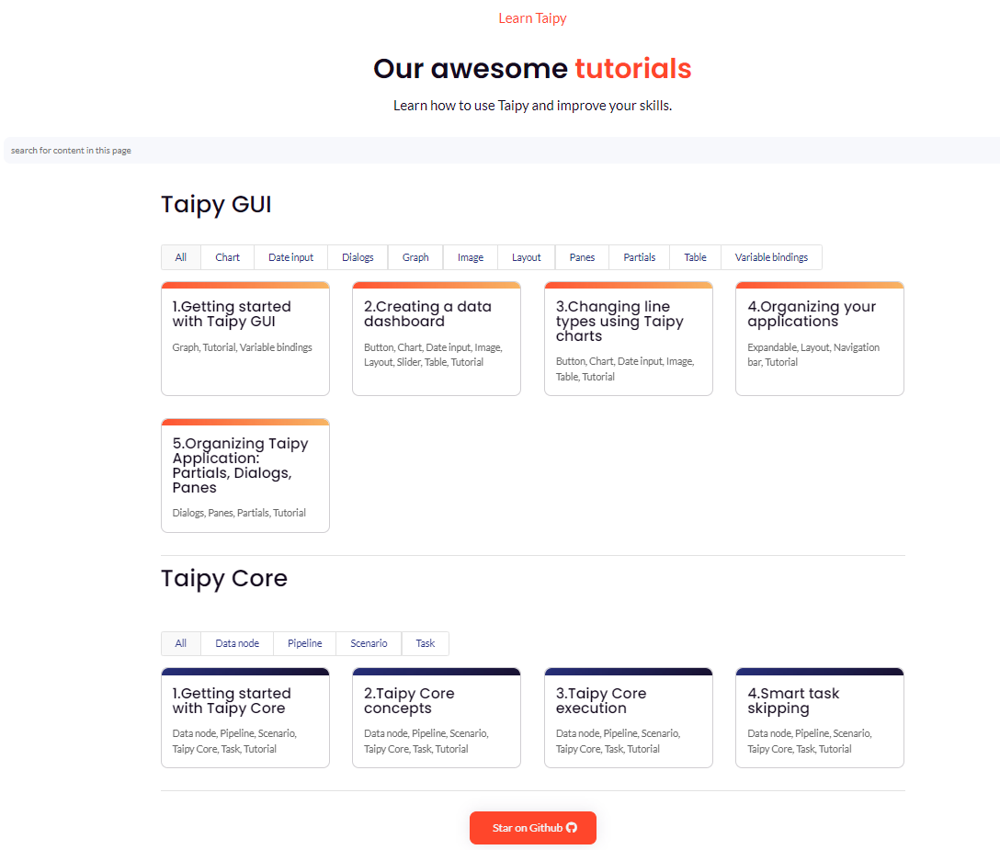

# Taipy Tutorials

Learn how to use Taipy and improve your skills with the following tutorials.

TODO:

In this page I want a list of all the tutorials. It should contain the 3 old 
getting started, plus the current tutorials we have in the website.

| Id   |            Title             |                                    description                                     |  keywords   |                                    link to the markdown page | 
|:-----|:----------------------------:|:----------------------------------------------------------------------------------:|:-----------:|-------------------------------------------------------------:|
| 1    |      Understanding GUI       | Understand basic knowledge of Taipy GUI creating of a multi-page NLP application.  |  **TODO**   |                     [gui tuto](./understanding_gui/index.md) |
| 2    | Scenario management Overview |              Learn the main features of the Taipy scenario management              |  **TODO**   | [scenario mgt tuto](./scenario_management_overview/index.md) |
| 3    |  How to use Taipy templates  | Use a taipy template to generate a complete application from back-end to front-end |  **TODO**   |                 [templates tuto](./using_templates/index.md) |

I would like to turn the previous tabel (which is incomplete) in to a beautiful page with 
similar layout as the one in the website:

{width=50%}
