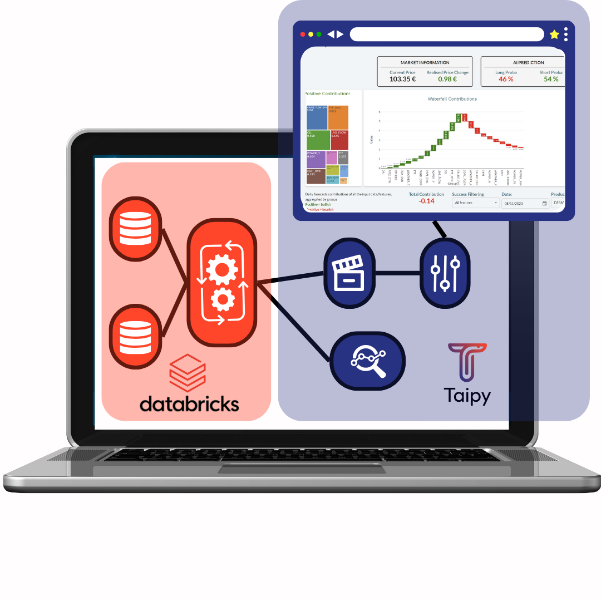

Integrating Taipy with Databricks is a great way to build user-centric applications. 
Taipy GUIs and SDM (Scenario and Data Management) will transform your Databricks models 
into interactive, production-ready applications for end-users. This article presents the 
best practice for integrating both platforms: calling Databricks jobs from a Taipy 
application. 

!!! warning "Available in Taipy Enterprise edition"

    The documentation and classes for connecting Databricks and Taipy are provided as 
    part of Taipy Enterprise

The Enterprise documentation demonstrates how to integrate Taipy scenarios with 
Databricks jobs. Taipy's scenarios serve as a potent tool for orchestrating tasks and 
performing 'what-if' analysis (i.e. examining various versions of a business problem). 

{width=50% : .tp-image}
