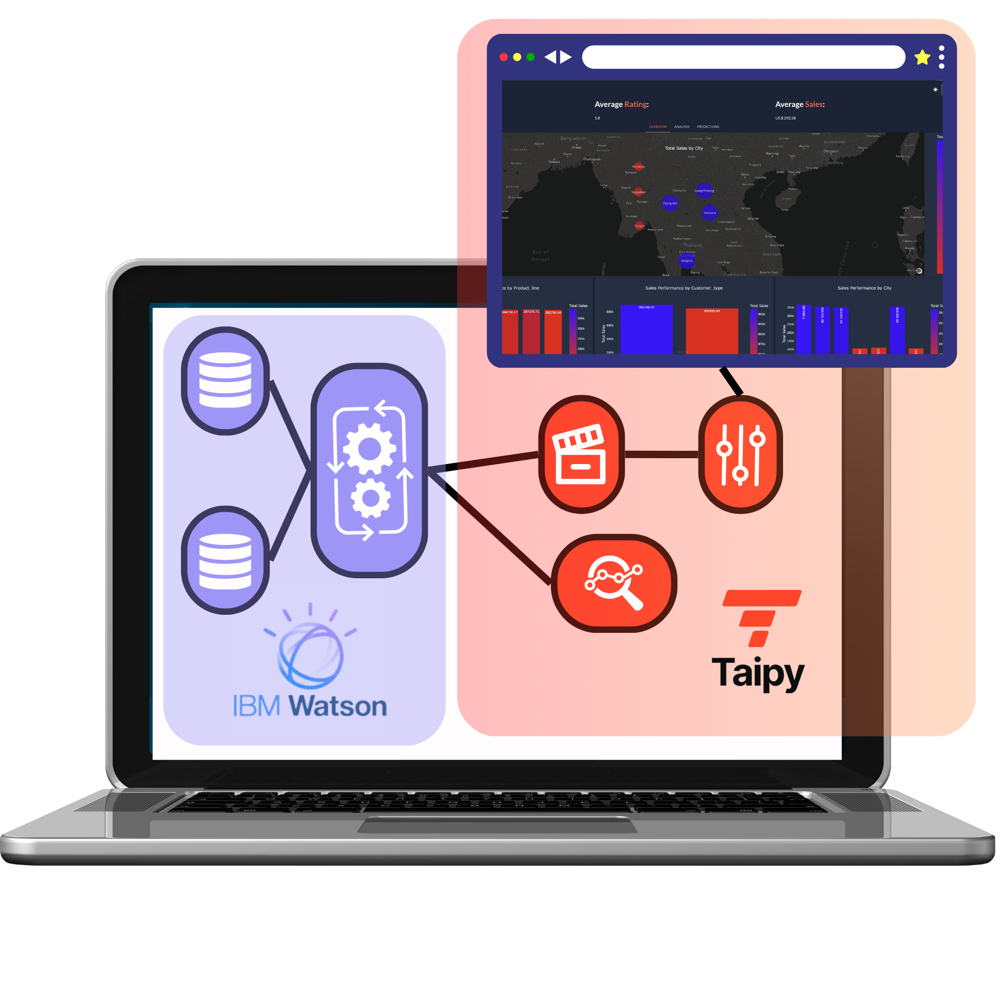

Integrating Taipy with IBM Watson Studio is a great way to build user-centric applications. 
Taipy capabilities, in particular the GUIs and the what-if analysis, will transform your Watson Studio jobs/models  
into interactive, production-ready applications for end-users. This article presents how to call 
Watson Studio jobs from a Taipy application.


By integrating IBM Watson Studio projects with Taipy scenarios, you can streamline 
workflows for “what-if” analysis and scenario comparison, which are crucial for 
developing robust Decision Support Systems for your end-users. This integration involves 
creating custom jobs to interact with IBM Watson Studio's API, allowing you to read from 
and write to datasets, execute code, and seamlessly combine Watson Studio's capabilities 
with Taipy's task and data management.

{width=50% : .tp-image}

# Scenarios and Watson Studio Integration

Creating and executing jobs on Watson Studio involves several steps, from setting up your 
Watson Studio environment to defining and running jobs. Here's a step-by-step guide on how 
to create and run jobs on Watson Studio, which can be seamlessly integrated with Taipy 
scenarios:

**Requirements:**

- An IBM Watson Studio Workspace.

**1 - Create a Watson Studio Notebook**

- **Navigate to Project:** In Watson Studio, navigate to the project where you want to 
create the notebook.

- **Create a Notebook:** Click on the "Assets" tab, then select "Add to project" and choose 
"Notebook."

- **Define Notebook Details:** Enter a name for your notebook, choose the language 
(e.g., Python, R, or Scala), and select the runtime environment you want to use.

**2 - Define Watson Studio Job Logic**

- **Create the Environment**: Go to the "Environments" section to create a runtime 
environment with the packages required by your code.

- **Write Code:** In the notebook, write the code that defines the logic of your 
Watson Studio job. This code can include data processing, analysis, or any other tasks you 
need to perform.

Here is an example of a Watson Studio Notebook where parameters are passed to the job 
and results are then retrieved:

```python
import pandas as pd

# Get the parameter values
param1 = os.getenv("param1")
param2 = os.getenv("param2")

# Use the parameter values in your code if you like
print("Parameter 1:", param1)
print("Parameter 2:", param2)

def dummy(param1, param2):
    # create your code and logic
    data = pd.read_csv("https://raw.githubusercontent.com/Avaiga/taipy-getting-started-core/develop/src/daily-min-temperatures.csv")

    # Results sent as the output of the job
    result = data[:5]
    return result

result = dummy(param1, param2)

print(result)
```

`os.getenv("param1")`: is how you can get the parameters passed to your job. 
Note that results and parameters are stringified. Only JSON-serializable objects can be 
passed through this interface.

- **Test in Notebook:** Test your code within the notebook to ensure it runs 
successfully.

**3 - Create a Watson Studio Job**

- **Convert Notebook to Job:** Follow this [tutorial](https://www.ibm.com/docs/en/cloud-paks/cp-data/4.8.x?topic=jobs-creating-in-notebook-editor) 
to create a job from your Notebook.

**4 - Run and Monitor the Watson Studio Job**

- **Run the Job:** After configuring the job settings, click "Run Now" to execute the 
job immediately.

- **Monitor Job Execution:** Monitor the job execution in real-time. Watson Studio 
provides logs and detailed information about the job's progress.

# Watson Studio Class: Bridging the Gap

To seamlessly integrate Watson Studio jobs with scenarios, we introduce the `WatsonStudio` 
class. This class is to be used within your own Taipy project. It facilitates 
communication with Watson Studio environments, enabling users to 
trigger jobs and retrieve results.

```python
import requests
import time
import logging
import os


class WatsonStudio:
    def __init__(self, api_key, project_id, job_id, *args, **kwargs):
        # Initialization details...

    def run_and_get_results(self, job_id, parameters=None, timeout=900):
        """
        Call a Watson Studio job based on the job_id, wait for job completion, and return the result.
        The timeout is approximate.
        """
        # Execute Watson Studio job...
```

The `WatsonStudio` class allows users to trigger jobs, monitor their status, and retrieve 
results seamlessly within the Taipy framework. You can now add a 
function that runs and retrieves the appropriate results in your project.

```python
default_param = {"param1": "value1", "param2": "value2"}

# It can be find in your IBM Watson Studio URL
JOB_ID = "your_job_id" 

def predict(parameters):
    watson_studio = WatsonStudio(os.environ['WATSON_BEARER_TOKEN'],
                                 os.environ['WATSON_ENDPOINT'],
                                 os.environ['PROJECT_ID'])

    try:
        return watson_studio.run_and_get_results(JOB_ID, parameters)
    except Exception as e:
        try:
            logging.info("Taipy tries predict a second time")
            return watson_studio.run_and_get_results(JOB_ID, parameters)
        except Exception as e:
            logging.info(f'Error during the Watson Studio call\n{e}')
            return None
```

As you can see, multiple values are used to connect to Watson Studio and to the right job.

- *JOB_ID*: The job ID. You can find it in the IBM Watson Studio URL.
- *WATSON_BEARER_TOKEN*: Create one by requesting one through an API call. Here is a 
[tutorial to create an API Key](https://cloud.ibm.com/docs/account?topic=account-userapikey) 
and here to [create the Bearer Token from the API Key](https://cloud.ibm.com/docs/account?topic=account-iamtoken_from_apikey).
- *WATSON_ENDPOINT*: The API endpoint of IBM Watson Studio. It depends on your location. 
For example: `"https://api.eu-de.dataplatform.cloud.ibm.com"`
- *PROJECT_ID*: Your Watson Studio project ID. You can find it in the IBM Watson Studio URL.

This *predict()* function is usable by Taipy inside a scenario. A potential 
integration into the configuration is as follows:

```python
from taipy import Config

params_cfg = Config.configure_data_node("params",
                                        default_data={"param1": "value1",
                                                      "param2": "value2"})

results_cfg = Config.configure_data_node("result")

task_watson_studio_cfg = Config.configure_task("watson_studio",
                                               input=[params_cfg],
                                               function=predict,
                                               output=[results_cfg])

scenario_cfg = Config.configure_scenario("scenario", task_config=[task_watson_studio_cfg])
```

Now that the scenario is configured, it can be instantiated and executed to retrieve the 
proper results.

```python
import taipy as tp

if __name__ == "__main__":
    tp.Core().run()

    scenario = tp.create_scenario(scenario_cfg)

    scenario.submit()
    print(scenario.result.read())
```

[Download the code](./src/example.py){: .tp-btn target='blank' }

# Watson Studio + Taipy

In conclusion, integrating Watson Studio jobs with Taipy scenarios is unlocked by creating a 
class for handling Watson Studio jobs. This class can then be used inside Taipy as a 
standard Taipy task. With this capability, you can incorporate any Watson Studio workflow 
within Taipy and benefit from:

- Great scalable interactive graphics,
- Taipy’s what-if analysis, supported by its scenario management,
- Integration with existing databases and jobs.
