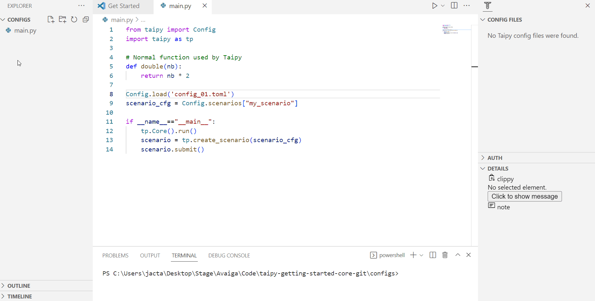

> You can download the code of this step [here](../src/step_01.py) or all the steps [here](https://github.com/Avaiga/taipy-getting-started-core/tree/develop/src).

# Step 1: Configuration and execution

Before looking at some code examples, let’s define some basic terms Taipy Core uses. Taipy Core revolves around four major concepts.

## Four fundamental concepts in Taipy Core:
- [**Data Nodes**](https://docs.taipy.io/en/latest/manuals/core/concepts/data-node/): are the translation of _variables_ in Taipy. Data Nodes don't contain the data but know how to retrieve it. They can refer to any data: any Python object (string, int, list, dict, model, data frame, etc.), a Pickle file, a CSV file, a SQL database, etc. They know how to read and write data. You can even write your own custom Data Node to access a particular data format.

- [**Tasks**](https://docs.taipy.io/en/latest/manuals/core/concepts/task/): are the translation of _functions_ in Taipy.

- [**Pipelines**](https://docs.taipy.io/en/latest/manuals/core/concepts/pipeline/): are a list of tasks executed with intelligent scheduling created automatically by Taipy. They usually represent a sequence of Tasks/functions ranging from data processing steps to simple baseline Algorithms all the way to more sophisticated pipelines: Machine-Learning, Mathematical models, Simulation, etc.

- [**Scenarios**](https://docs.taipy.io/en/latest/manuals/core/concepts/scenario/): End-Users often require modifying various parameters to reflect different business situations. Taipy Scenarios provide the framework to "run"/"execute" pipelines under different conditions/variations (i.e., data/parameters modified by the end-user)


## What is a configuration?

A [**configuration**](https://docs.taipy.io/en/latest/manuals/core/config/) is a structure to define scenarios and pipelines. It represents our Direct Acyclic Graph(s); it models the data sources, parameters, and tasks. Once defined, a configuration acts like a superclass; it is used to generate different instances of scenarios.


Let's create our first configuration. For this, we have two alternatives:

- Using Taipy Studio

- Or directly coding in Python.

Once the scenario configuration is defined, we can create instances, aka *'entities'* of scenarios, that can be submitted for execution. Entities are made from all configuration objects: scenario config, pipeline config, tasks, and data node configs. We will refer to them as _scenario entities_, _pipeline entities_, _task entities_, and _Data Node entities_. Since this is very much like the mechanism of class and instances present in object programming, we will use the word entity and instance interchangeably. 

Let’s consider the simplest possible pipeline: a single function taking as input an integer and generating an integer output (doubling the input number). See below:


```python
from taipy import Config
import taipy as tp

# Normal function used by Taipy
def double(nb):
    return nb * 2
```

{ width=700 style="margin:auto;display:block;border: 4px solid rgb(210,210,210);border-radius:7px" }

- Two Data Nodes are being configured ('input' and 'output'). The 'input' Data Node has a _default_data_ set at 21. They will be stored as Pickle files (default storage format) and unique to each scenario entity/instance (this is the concept of scope which is covered later’). To clarify, the names given to the Data Nodes are arbitrary. The task links the two Data Nodes through the Python function double.

- The pipeline contains this task, and the scenario includes this single pipeline.

!!! example "Configuration"

    === "Taipy Studio"

        **Alternative 1:** Configuration using Taipy Studio

        By watching the animation below, you can feel how this configuration gets created using Taipy Studio. Once created, the configuration can be saved as a TOML file (see below)


        { width=700 style="margin:auto;display:block;border: 4px solid rgb(210,210,210);border-radius:7px" }


        **Note**: Remember to save the file after each change.
        
        - Create a new file: 'config_01.toml'
        
        - Open Taipy Studio view
        
        - Right-click on the right configuration and choose 'Taipy: Show View'
        
        - Add your first Data Node by clicking the button on the right corner of the window
        
        - Create a name for it and change its details in the 'Details' section of Taipy Studio
        
            - name: input
                
            - Details: default_data=21, storage_type=pickle
                
        - Do the same for the output
        
            - name: output
                
            - Details: storage_type=pickle
                
        - Add a task and choose a function to associate with `<module>.<name>`
        
            - name: double
                
            - Details: function=`__main__.double`
                
        - Link the Data Nodes and the task
        
        - Add a pipeline and link it to the task
        
        - Add a scenario and link to the pipeline

        To use this configuration in our code (`main.py` for example), we must load it and retrieve the `scenario_cfg`. This `scenario_cfg` is the basis to instantiate our scenarios.

        ```python
        Config.load('config_01.toml')

        # my_scenario is the id of the scenario configured
        scenario_cfg = Config.scenarios['my_scenario']
        ```

    === "Python configuration"

        **Alternative 2:** Configuration using Python Code

        Here is the code to configure a simple scenario.

        ```python
        # Configuration of Data Nodes
        input_data_node_cfg = Config.configure_data_node("input", default_data=21)
        output_data_node_cfg = Config.configure_data_node("output")

        # Configuration of tasks
        task_cfg = Config.configure_task("double",
                                         double,
                                         input_data_node_cfg,
                                         output_data_node_cfg)

        # Configuration of the pipeline and scenario
        pipeline_cfg = Config.configure_pipeline("my_pipeline", [task_cfg])
        scenario_cfg = Config.configure_scenario("my_scenario", [pipeline_cfg])
        ```

The code below presents how you can create scenarios and submit them.

First of all, Taipy Core has to be launched(`tp.Core().run()`). It will create a service that acts as a job scheduler.

Creating a scenario/pipeline (`tp.create_scenario(<Scenario Config>)` / `tp.create_pipeline(<Pipeline Config>)`) will create all its related entities (_tasks_, _Data Nodes_, etc). These entities are being created thanks to the previous configuration. Still, no scenario has been run yet. `tp.submit(<Scenario>)` is the line of code that will run all the scenario-related pipelines and tasks. Note that a pipeline or a task can also be submitted directly (`tp.submit(<Pipeline>)`, `tp.submit(<Task>)`).

```python
# Run of the Core
tp.Core().run()

# Creation of the scenario and execution
scenario = tp.create_scenario(scenario_cfg)
tp.submit(scenario)

print("Value at the end of task", scenario.output.read())
```

Results:

```
[2022-12-22 16:20:02,740][Taipy][INFO] job JOB_double_699613f8-7ff4-471b-b36c-d59fb6688905 is completed.
Value at the end of task 42
```    

'/.data' is the default storage folder for Taipy Core. It contains data, scenarios, pipelines, jobs, and tasks. These entities can be persisted between two runs depending on how the code is run.

## Ways of executing the code: Versioning

Taipy Core provides a [versioning system](https://docs.taipy.io/en/latest/manuals/core/versioning/) to keep track of the changes that a configuration will experience over time: new data sources, new parameters, new versions of your Machine Learning engine, etc. `python main.py -h` opens a helper to understand the versioning options. Here are the principal ways to run the code with versioning:

- _Development_: is the default way of executing the code. When running a Taipy Core application in development mode, Taipy can’t access all entities created from a previous Development run. Launching your Taipy code as `python main.py` executes it in Development mode.

- _Experiment_: all Taipy Core entities from the previous run are kept, but each new run will ignore them. An identifier is attached to each run. 
`python main.py --experiment` will execute the code in Experiment mode. The user can then re-execute a previous run (by selecting a previously used identifier). This version number is as follows: `python main.py --experiment 1`.

- _Production_: When running a Taipy Core application in production mode, Taipy can access all entities attached to the current or another production version. It corresponds to the case where the application is stable and running in a production environment. The user can decide the identifier to use. `python main.py --production` will execute the code in Experiment mode, or `python main.py --production 1` to run it with a specific version.
