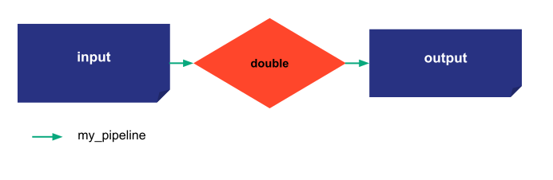

> You can download the code of this step [here](../src/step_02.py) or all the steps [here](https://github.com/Avaiga/taipy-getting-started-core/tree/develop/src).

# Step 2: Basic functions

Let's discuss some of the essential functions that come along with Taipy.

- [`<Data Node>.write(<new value>)`](https://docs.taipy.io/en/latest/manuals/core/entities/data-node-mgt/#read-write-a-data-node): this instruction changes the data of a Data Node. It also changes the _last_edit_date_ of the Data Node, influencing whether a task can be skipped.

- [`tp.get_scenarios()`](https://docs.taipy.io/en/latest/manuals/core/entities/scenario-cycle-mgt/#get-all-scenarios): this function returns the list of all the scenarios

- [`tp.get(<Taipy object ID>)`](https://docs.taipy.io/en/latest/manuals/core/entities/data-node-mgt/#get-data-node): this function returns an entity based on the id of the entity

- [`tp.delete(<Taipy object ID>)`](https://docs.taipy.io/en/latest/manuals/core/entities/scenario-cycle-mgt/#delete-a-scenario): this function deletes the entity and nested elements based on the id of the entity

## Utility of having scenarios

Taipy lets the user create multiple instances of the same configuration. Data can differ between different scenario instances. It is essential to detect/understand the difference in data between scenario instances: e.g., comparing the output/results of different instances... Such differences in behavior between different scenarios entities (from the same scenario configuration) can be due to the following:

- Changing data from input data nodes, 

- Randomness in a task (random algorithm), 

- Different values from parameters set by the end-user, etc.

The developer can directly change the data nodes entities with the _write_ function (see below).

{ width=700 style="margin:auto;display:block;border: 4px solid rgb(210,210,210);border-radius:7px" }

```python
scenario = tp.create_scenario(scenario_cfg, name="Scenario")
tp.submit(scenario)
print("Output of First submit:", scenario.output.read())
```

Results:

```
[2022-12-22 16:20:02,874][Taipy][INFO] job JOB_double_a5ecfa4d-1963-4776-8f68-0859d22970b9 is completed.
Output of First submit: 42
```

## _write_ function

Data of a Data Node can be changed using _write_. The syntax is `<Scenario>.<Pipeline>.<Data Node>.write(value)`. If the scenario contains a single pipeline, we can write `<Scenario>.<Data Node>.write(value)`.


```python
print("Before write", scenario.input.read())
scenario.input.write(54)
print("After write",scenario.input.read())
```

Results:
```
Before write 21
After write 54
```

The submission of the scenario will update the output values.


```python
tp.submit(scenario)
print("Second submit",scenario.output.read())
```
Results:
```
[2022-12-22 16:20:03,011][Taipy][INFO] job JOB_double_7eee213f-062c-4d67-b0f8-4b54c04e45e7 is completed.
Second submit 108
```
    
## Other useful functions

- `tp.get_scenarios` accesses all the scenarios by returning a list.

```python
print([s.name for s in tp.get_scenarios()])
```

Results:
```
["Scenario"]
```

- Get an entity from its id:

```python
scenario = tp.get(scenario.id)
```

- Delete an entity through its id. For example, to delete a scenario:

```python
tp.delete(scenario.id)
```

