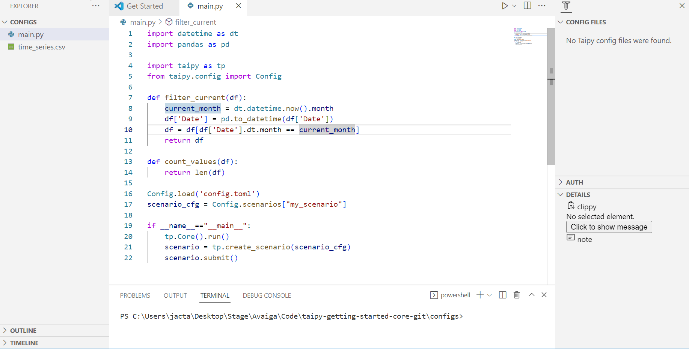

> You can download the code of this step [here](../src/step_04.py) or all the steps [here](https://github.com/Avaiga/taipy-getting-started-core/tree/develop/src).

# Step 3: Data Node types

- *[Pickle](https://docs.taipy.io/en/latest/manuals/core/config/data-node-config/#pickle)* (default): Taipy can read and write any data that can be serializable.

- *[CSV](https://docs.taipy.io/en/latest/manuals/core/config/data-node-config/#csv)*: Taipy can read and write any data frame as a CSV.

- *[JSON](https://docs.taipy.io/en/latest/manuals/core/config/data-node-config/#json)*: Taipy can read and write any JSONable data as a JSON file.

- *[SQL](https://docs.taipy.io/en/latest/manuals/core/config/data-node-config/#sql)*: Taipy can read and write from/to a SQL table or a SQL database.

- *[Mongo](https://docs.taipy.io/en/latest/manuals/core/config/data-node-config/#mongo-collection)*: Taipy can read and write from/to a Mongo Collection

- *[Parquet](https://docs.taipy.io/en/latest/manuals/core/config/data-node-config/#parquet)*: Taipy can read and write data frames from/to a Parquet format

- *[Generic](https://docs.taipy.io/en/latest/manuals/core/config/data-node-config/#generic)*: Taipy provides a generic Data Node that can read and store any data based on a custom _reading_ and _writing_ function created by the user.

This section will use the simple DAG/execution configuration described below. The configuration consists of the following:

1. Three Data Nodes:
2. 
-   _historical data_: This is a CSV-type Data Node. It reads from a CSV file into the initial data frame. You can find the dataset used in the Getting Started [here](https://github.com/Avaiga/taipy-getting-started-core/blob/develop/src/time_series.csv).

-   _month_data_: This is a pickle Data Node. It stores in a pickle format the data frame generated by the task '_filter_' (obtained after some filtering of the initial data frame).

-   _nb_of_values_: This is also a pickle Data Node. It stores an integer generated by the '_count_values_' task.  

3. Two tasks linking these Data Nodes:

-   _filter_: filters on the current month of the data frame

-   _count_values_: calculates the number of elements in this month

5. One single pipeline in this scenario configuration grouping these two tasks.


{ width=700 style="margin:auto;display:block;border: 4px solid rgb(210,210,210);border-radius:7px" }

```python
def filter_current(df):
    current_month = dt.datetime.now().month
    df['Date'] = pd.to_datetime(df['Date']) 
    df = df[df['Date'].dt.month == current_month]
    return df

def count_values(df):
    return len(df)
```

!!! example "Configuration"

    === "Taipy Studio"

        { width=700 style="margin:auto;display:block;border: 4px solid rgb(210,210,210);border-radius:7px" }

        - Create the beginning of the Config with Data Nodes following the graph.
       
        - Change the details of *historical_data* in the 'Details' section of Taipy Studio
        
            - name: historical_data
                
            - Details: default_path='xxxx/yyyy.csv', storage_type=csv
                
        - Add tasks: filter_current and count_values
        
        - Finish the Config by connecting tasks and Data Nodes and creating the pipeline and scenario

        To use this configuration in our code (`main.py` for example), we must load it and retrieve the `scenario_cfg`. This `scenario_cfg` is the basis to instantiate our scenarios.

        ```python
        Config.load('config_03.toml')

        # my_scenario is the id of the scenario configured
        scenario_cfg = Config.scenarios['my_scenario']
        ```

    === "Python configuration"

        ```python
        # here is a CSV Data Node
        historical_data_cfg = Config.configure_csv_data_node(id="historical_data",
                                                             default_path="time_series.csv")
        month_values_cfg =  Config.configure_data_node(id="month_data")
        nb_of_values_cfg = Config.configure_data_node(id="nb_of_values")
        ```


        ```python
        task_filter_cfg = Config.configure_task(id="filter_current",
                                                         function=filter_current,
                                                         input=historical_data_cfg,
                                                         output=month_values_cfg)

        task_count_values_cfg = Config.configure_task(id="count_values",
                                                         function=count_values,
                                                         input=month_values_cfg,
                                                         output=nb_of_values_cfg)
        ```


        ```python
        pipeline_cfg = Config.configure_pipeline(id="my_pipeline",
                                                 task_configs=[task_filter_cfg,
                                                               task_count_values_cfg])

        scenario_cfg = Config.configure_scenario(id="my_scenario",
                                                 pipeline_configs=[pipeline_cfg])

        ```


```python
tp.Core().run()

scenario_1 = tp.create_scenario(scenario_cfg, creation_date=dt.datetime(2022,10,7), name="Scenario 2022/10/7")
scenario_1.submit()

print("Nb of values of scenario 1:", scenario_1.nb_of_values.read())
```

Results:

```
[2022-12-22 16:20:03,424][Taipy][INFO] job JOB_filter_current_257edf8d-3ca3-46f5-aec6-c8a413c86c43 is completed.
[2022-12-22 16:20:03,510][Taipy][INFO] job JOB_count_values_90c9b3c7-91e7-49ef-9064-69963d60f52a is completed.
    
Nb of values of scenario 1: 896
```
