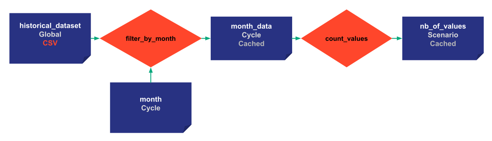
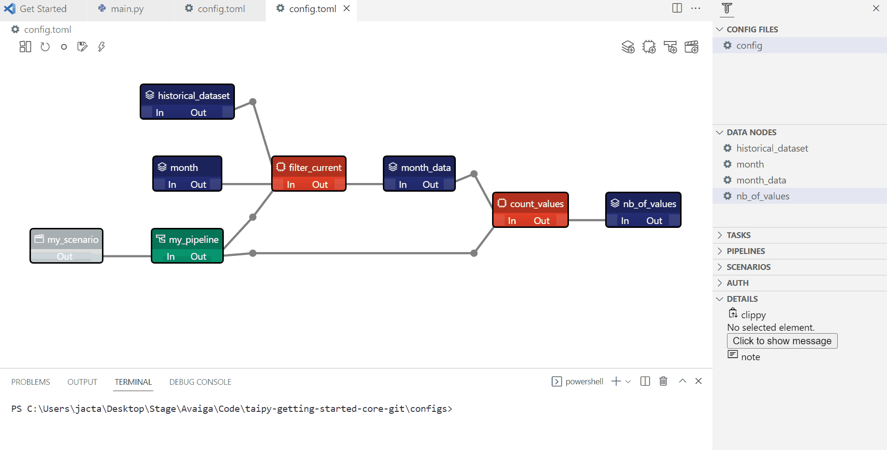

> You can download the code of this step [here](../src/step_06.py) or all the steps [here](https://github.com/Avaiga/taipy-getting-started-core/tree/develop/src).

# Step 6: Skipping tasks

Skipping tasks is an essential feature of Taipy. Running twice a function with the same input parameters will create the same output for a given pipeline or scenario. Executing this sort of function is a waste of time and resources.

Taipy Core provides for each task the _skippable_ attribute. If this attribute is set to True, Taipy Core’s scheduler will automatically detect if changes have occurred on any of the input Data Nodes of a task. If no changes have occurred, it will automatically skip the execution of that task. By default, skippable is set to False. 


{ width=700 style="margin:auto;display:block;border: 4px solid rgb(210,210,210);border-radius:7px" }

!!! example "Configuration"

    === "Taipy Studio"

        { width=700 style="margin:auto;display:block;border: 4px solid rgb(210,210,210);border-radius:7px" }

        - Add the skippable to the tasks
        
            - name: filter_current
                
            - Details: function=`__main__.filter_current:function`, skippable=True:bool
                
        - Do the same for count_values


        ```python
        Config.load('config_06.toml')

        # my_scenario is the id of the scenario configured
        scenario_cfg = Config.scenarios['my_scenario']
        ```

    === "Python configuration"

        ```python
        task_filter_cfg = Config.configure_task(id="filter_by_month",
                                                     function=filter_by_month,
                                                     input=[historical_data_cfg, month_cfg],
                                                     output=month_values_cfg,
                                                     skippable=True)

        task_count_values_cfg = Config.configure_task(id="count_values",
                                                         function=count_values,
                                                         input=month_values_cfg,
                                                         output=nb_of_values_cfg,
                                                         skippable=True)
        ```

The configuration is almost the same. `skippable=True` are added to the tasks we want to be skipped.

Here we create three different scenarios with different creation dates and names. Scenario 1 and scenario 2 belong to the same cycle.


```python
tp.Core().run()

scenario_1 = tp.create_scenario(scenario_cfg,
                                creation_date=dt.datetime(2022,10,7),
                                name="Scenario 2022/10/7")
scenario_2 = tp.create_scenario(scenario_cfg,
                               creation_date=dt.datetime(2022,10,5),
                               name="Scenario 2022/10/5")
scenario_3 = tp.create_scenario(scenario_cfg,
                                creation_date=dt.datetime(2021,9,1),
                                name="Scenario 2022/9/1")
```


```python
# scenario 1 and 2 belong to the same cycle, so 
# defining the month for scenario 1 defines the month for the scenarios in the cycle
scenario_1.month.write(10)
print("Scenario 1: month", scenario_1.month.read())
print("Scenario 2: month", scenario_2.month.read())
```

Results:

```
Scenario 1: month 10
Scenario 2: month 10
```

Every task has yet to be submitted, so when submitting scenario 1, all tasks will be executed.

```python
print("Scenario 1: submit")
scenario_1.submit()
print("Value", scenario_1.nb_of_values.read())
```

Results:

```
Scenario 1: submit
[2022-12-22 16:20:09,079][Taipy][INFO] job JOB_filter_by_month_0d7836eb-70eb-4fe6-b954-0e56967831b6 is completed.
[2022-12-22 16:20:09,177][Taipy][INFO] job JOB_count_values_91214241-ce81-42d8-9025-e83509652133 is completed.
Value 849
```

When submitting scenario 2, the scheduler will skip the first task of this second scenario. Indeed, the two scenarios share the same input Data Nodes for this task, and no changes have occurred on these Data Nodes (since the last task run when we submitted scenario 1).

```python
# the first task has already been executed by scenario 1
print("Scenario 2: first submit")
scenario_2.submit()
print("Value", scenario_2.nb_of_values.read())
```

Results:
```
Scenario 2: first submit
[2022-12-22 16:20:09,317][Taipy][INFO] job JOB_filter_by_month_c1db1f0c-6e0a-4691-b0a3-331d473c4c42 is skipped.
[2022-12-22 16:20:09,371][Taipy][INFO] job JOB_count_values_271cefd0-8648-47fa-8948-ed49e93e3eee is completed.
Value 849
```

Resubmitting the same scenario without any change will skip every task.

```python
# every task has already been executed so that the scheduler will skip everything
print("Scenario 2: second submit")
scenario_2.submit()
print("Value", scenario_2.nb_of_values.read())
```

Results:
```
Scenario 2: second submit
[2022-12-22 16:20:09,516][Taipy][INFO] job JOB_filter_by_month_da2762d1-6f24-40c1-9bd1-d6786fee7a8d is skipped.
[2022-12-22 16:20:09,546][Taipy][INFO] job JOB_count_values_9071dff4-37b2-4095-a7ed-34ef81daad27 is skipped.
Value 849
```

This scenario is not in the same cycle. We change the month to 9, and the scheduler will complete every task. 


```python
# scenario 3 has no connection to the other scenarios, so everything will be executed
print("Scenario 3: submit")
scenario_3.month.write(9)
scenario_3.submit()
print("Value", scenario_3.nb_of_values.read())
```

Results:
```
Scenario 3: submit
[2022-12-22 16:20:10,071][Taipy][INFO] job JOB_filter_by_month_c4d06eba-a149-4b79-9194-78972c7b7a18 is completed.
[2022-12-22 16:20:10,257][Taipy][INFO] job JOB_count_values_817df173-6bae-4742-a2c0-b8b8eba52872 is completed.
Value 1012
```  

Here, we change the input Data Node of the pipeline so Taipy will re-run the correct tasks to ensure that everything is up-to-date.


```python
# changing an input data node will make the task be executed
print("Scenario 3: change in historical data")
scenario_3.historical_data.write(pd.read_csv('time_series_2.csv'))
scenario_3.submit()
print("Value", scenario_3.nb_of_values.read())
```

Results:

```
Scenario 3: change in historical data
[2022-12-22 16:20:10,870][Taipy][INFO] job JOB_filter_by_month_92f32135-b410-41f0-b9f3-a852c2eb07cd is completed.
[2022-12-22 16:20:10,932][Taipy][INFO] job JOB_count_values_a6a75e13-4cd4-4f7e-bc4e-d14a86733440 is completed.
Value 1012
```
