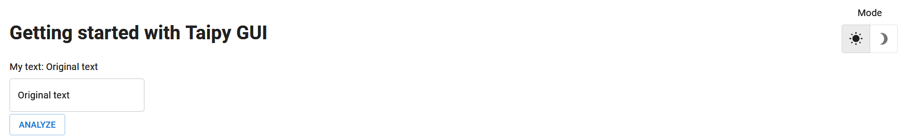

> You can download the code of this step [here](../src/step_03.py) or all the steps [here](https://github.com/Avaiga/taipy-getting-started-gui/tree/develop/src).

!!! warning "For Notebooks"

    The "Getting Started" Notebook is available [here](https://docs.taipy.io/en/latest/getting_started/getting-started-gui/getting_started.ipynb). In Taipy GUI, the process to execute a Jupyter Notebook is different from executing a Python Script.

# Step 3: Interaction

Now, the page has several visual elements:

- A text that is connected to the Python variable *text*;

- An input that changes the value *text* automatically.

Taipy GUI manages everything in the background.

To go further with Taipy GUI, let's introduce the concept of **state**. Thanks to this state concept, Taipy natively provides multi-user GUI apps.

## Multi-user - state

Try to open a few clients with the same URL. You will see that every client is independent of each other; you can change *text* on a client, and *text* will not change in other clients. This is due to the concept of **state**.

The state holds the value of all the variables used in the user interface for one specific connection.

For example, in the beginning, `state.text = 'Original text'`. When *text* is modified by the input (through a given graphical client), this is, in fact, *state.text* that is modified, not *text* (the global Python variable). Therefore, if you open two different clients, *text* will have two state values (*state.text*), one for each client.

In the code below, this concept will be used to:

- Notify the user when the button is pressed;

- Reset the input when the text equals "Reset".

## How to connect two variables - the *[on_change()](https://docs.taipy.io/en/latest/manuals/gui/callbacks/)* function

In *Taipy*, the `on_change()` function is a "special" function. **Taipy** will check if you created and will use a function with this name. Whenever the state of a variable is modified, the *callback* function is called with three parameters:

- state (the state object containing all the variables);

- The name of the modified variable;

- Its value.

Here, `on_change()` will be called whenever the text's value (*state.text*) changes. If a variable is changed in this function, Taipy will propagate this change automatically to the associated visual elements.

Other callbacks specific to visual elements exist. They are named _on_change_ or _on_action_. For example, a button has an _on_action_ property. When the button is pressed, Taipy will call the function referenced in the _on_action_ property.

```python
from taipy.gui import Gui, notify

text = "Original text"

# Definition of the page
page = """
# Getting started with Taipy GUI

My text: <|{text}|>

<|{text}|input|>

<|Run local|button|on_action=on_button_action|>
"""

def on_button_action(state):
    notify(state, 'info', f'The text is: {state.text}')
    state.text = "Button Pressed"

def on_change(state, var_name, var_value):
    if var_name == "text" and var_value == "Reset":
        state.text = ""
        return


Gui(page).run()
```

{ width=700 style="margin:auto;display:block;border: 4px solid rgb(210,210,210);border-radius:7px" }

[_notify()_](https://docs.taipy.io/en/latest/manuals/gui/notifications/) is a Taipy GUI function that creates a notification with text. The user can pass multiple parameters, including the _state_, the _notification_type_, and the _message_.
