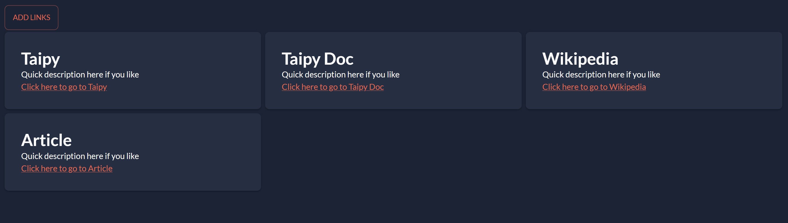

Taipy's partials feature allows you to create reusable and dynamically updatable 
components in your GUI applications. This is particularly useful for creating consistent 
layouts and updating content on the fly. For example, you can create a list of links that 
can be dynamically updated without reloading the entire page.

{width=50% : .tp-image-border}

In this article, we will walk through a simple example where:

- A main page displays a list of links.
- The list can be dynamically updated with new links using a button click.

{width=90% : .tp-image-border}

Here is the code for the main script:

=== "Markdown"
    ```python linenums="1"
        ``` 
=== "Python"
    ```python linenums="1"
    
    ``` 


This script creates a button that, when clicked, updates the list of links displayed on 
the page. The links component is encapsulated within a partial, making it reusable and 
dynamically updatable.

# Code explanation

Here’s a step-by-step explanation of how partials are used in the provided example:

## Step 1: Declaring the Partial

At the end of the script, we declare the partial with the GUI. This is where we 
initialize the partial with some initial value or content. 

```python
gui = Gui(main_page)
link_partial = gui.add_partial("")
gui.run()
```

Here, `link_partial` is declared with an empty string. This partial will be dynamically 
updated later.

## Step 2: Using the Partial in the Layout

The partial needs to be placed within the layout where it will be displayed. You can 
include it in one or multiple places within your layout.

=== "Markdown"
    ```python linenums="1"
    main_page = """
    <|Add links|button|on_action=simulate_adding_more_links|>
    <|part|partial={link_partial}|>
    """
    ``` 
=== "Python"
    ```python linenums="1"
    with tgb.Page() as main_page:
        tgb.button('Add links', on_action=simulate_adding_more_links)
        tgb.part(partial="{link_partial}")
    ``` 


In this code, `tgb.part(partial="{link_partial}")` is where the partial will be shown. 
You can place this partial in multiple locations within your layout if needed.

## Step 3: Updating the Partial Content

To dynamically update the partial, you use the `update_content` method. This can be done 
using either the Markdown syntax or the Python API by providing a page to this method.

=== "Markdown"
    ```python linenums="1"
    def refresh_links(state):
        partial_md = ""
        partial_md += "<|layout|columns=1 1 1|\n"
        for link in state.links:
            link_name, link_url = link
            partial_md += "<|card|\n"
            partial_md += f"## {link_name}\n"
            partial_md += "Quick description here if you like\n"
            partial_md += f"[Click here to go to {link_name}]({link_url})\n"
            partial_md += "|>\n"
        partial_md += "|>\n"
        state.link_partial.update_content(state, partial_md)
    ``` 
=== "Python"
    ```python linenums="1"
    def refresh_links(state):
        with tgb.Page() as link_part:
            with tgb.layout("1 1 1"):
                for link in state.links:
                    link_name, link_url = link
                    with tgb.part("card"):
                        tgb.text(link_name, class_name="h2")
                        tgb.text('Quick description here if you like')
                        tgb.html('a', f'Click here to go to {link_name}', href=link_url)
                        # You could use any visual element you like
        state.link_partial.update_content(state, link_part)
    ``` 

We create a new `link_part` page using the Taipy builder API in this function. We then 
use `state.link_partial.update_content(state, link_part)` to update the partial content. 
Here, `link_part` is a dynamically generated page that contains the new list of links.

# Points to remember

**1 - Declare the Partial:** A partial must be declared with an initial value or content.

`link_partial = gui.add_partial("")` declares a partial with an initial empty content.

**2 - Partial in the Layout:** Place the partial in the layout where you want it to be displayed.

`tgb.part(partial="{link_partial}")` specifies where the partial will be displayed in the 
layout.

**3 - Update the Partial Content:** Update the partial content dynamically using 
`update_content`.

The `refresh_links` function generates new content using the builder API. 
`state.link_partial.update_content(state, link_part)` updates the partial with the new 
content.

# Conclusion

Taipy partials are a powerful feature for creating reusable and dynamically updatable 
components in your GUI applications. Understanding these concepts allows you to leverage 
Taipy partials to create more dynamic and responsive GUIs.
