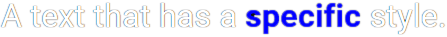
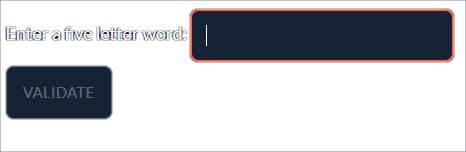
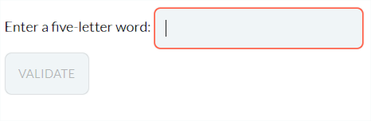
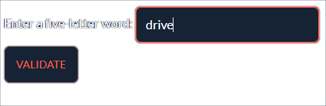
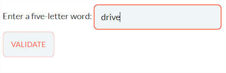
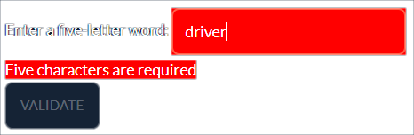
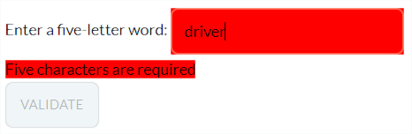
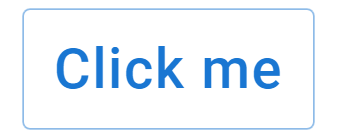

As mentioned several times, page content is parsed and converted to be sent
to the user's browser. The final page content actually is pure HTML that one can apply
some style to, providing the best user experience.

Styling involves some knowledge of [Cascading Style Sheets](https://www.w3.org/Style/CSS/).
This section describes what sort of styling you may want to apply, in different situations.

Taipy GUI comes with a set of stylesheets that give applications an homogeneous and solid
look and feel. This set of stylesheet is grouped in what is called the *Stylekit*.<br/>
The Stylekit is easy to customize and provides few utility CSS classes that accelerates the
development of specific styles to apply to pages.<br/>
The Stylekit is documented in the [Stylekit section](stylekit.md) of this documentation,
where you can find all the information on how to use and customize it.

# Style sheets

There are two ways you can apply a stylesheet to your application:

- Global style sheet.<br/>
  The *css_file* parameter of the `Gui.__init__^`(`Gui` constructor) lets you specify a CSS file
  that your application will use for every page.<br/>
  The default value for this parameter is a file located next to your main Python script, with the
  same name except for the extension that must be '.css'.<br/>
  If such a file does not exist, Taipy GUI will search for a file called `taipy.css` and load it
  if it exists. This mechanism allows sharing the same stylesheet across all Taipy GUI applications
  whose main script sits in the same directory.<br/>
  If you need to apply styles for a specific application but want to benefit from the shared styles
  defined in `taipy.css`, you can add the directive `@import url("taipy.css");` to your
  application-specific CSS file.

- Page-specific style.<br/>
    The method `Gui.add_page()^` has a *style* parameter that can be set to CSS content.
    This additional style is applied to the page (and **only** this page).<br/>
    Using `(Gui.)add_page()^` is equivalent to using the *style* parameter provided in all the page
    classes: `Markdown^`, `(taipy.gui.)builder.Page^` and `Html^`.

    The parameter to the *style* parameter is a dictionary where keys describe the CSS selector to
    apply, and the value is the rule declaration, expressed as a dictionary (each key being the
    CSS property name and each value being the property value).<br/>
    Here is an example of defining CSS styling on a page. We will address the `Markdown^` use case,
    but the situation is identical in the Page Builder and HTML cases.<br/>
    Consider the following definition:
    ```python
    page = Markdown("... markdown content",
                    style = {
                      ".taipy-button": {
                        "background-color": "red"
                      }
                    }
    ```
    This style creates a single CSS rule that will apply to all `button` controls of this page,
    giving them a red background color.

    Note that
    [nested CSS](https://developer.mozilla.org/en-US/docs/Web/CSS/CSS_nesting/Using_CSS_nesting)
    is supported: the CSS declaration can be a CSS rule itself. Here is an example:
    ```python
    page = Markdown("... markdown content",
                    style = {
                      ".taipy-slider": {
                        ".MuiSlider-rail": {
                          "background-color": "yellow"
                      }
                    }
    ```
    This style definition will apply the yellow color to the rail of a `slider` control. It does
    this by selecting all the elements with the ".MuiSlider-rail" class that are a descendants
    of elements with the ".taipy-slider" class (`slider` controls).

Besides explicit style sheets, you can also modify the global theme, as
described in the [section on Themes](#themes).

# Applying style

Once the style sheets are set for the application, you can start learning about
how styles can be applied to pages.

## Global styles

As in any web application, the root element (`:root`) is available for global
style settings.<br/>
For example, if you want to make your application bigger by enlarging the
font size, you could write:
```css
:root {
  font-size: 2rem;
}
```
And all pages will appear twice as big.


## Styling Markdown

Thanks to the [*Attribute Lists*](https://python-markdown.github.io/extensions/attr_list/)
extension, the Markdown text can hold attributes used for styling.

If, for example, your Markdown content is the following:
```
Un-styled text line.

Styled text line.
{: .blue }
```

and a stylesheet used by the application defined the *blue* CSS class:
```css
.blue {
  color: blue;
}
```
then the text line is displayed in blue:

<figure>
  
  
  <figcaption>Styling paragraphs</figcaption>
</figure>

That would apply to the entire preceding paragraph.

If you want to set the style for an inline element of the text (such as a
bold section identified by the "\*\*" markers), you can use the same
attribute syntax, right after the text fragment, without any space
character.<br/>
The following Markdown content:
```
A text that has a **specific**{: .blue } style.
```
will apply the *blue* class to the bold text fragment:
<figure>
  
  
  <figcaption>Styling fragments</figcaption>
</figure>

Note that to style a heading, the syntax is slightly different: right after the text of the heading,
you must insert a white space, as many sharp (#) characters as the heading uses, another white
space, then the style construct.<br/>
Here is an example that works properly:
```
## My heading ## {: .my-style }
```

Please check the documentation for the *Attribute Lists* extension for more information.

!!! note "div vs. p"
    Instead of generating &lt;p&gt; HTML tags for lines of text, Taipy
    uses &lt;div&gt; tags. This allows more complex structures in pages,
    such as elements within elements.

## Main page style

The top-most element of the generated page is a &lt;div&gt; element with
the 'id' attribute set to "root".

If you need to reference the top-most element of your page, you
can select it in your CSS stylesheets using the selector: `div#root`.

## Visual elements-specific styles

You can apply some style to any visual element you have added to
your pages.

### Using CSS classes

Every visual element is assigned a CSS class that depends on the type
of the element.<br/>
The default associated class name is made of the string *"taipy-"* followed
by the type of element: all Taipy buttons, for example, have the CSS
class name: *"taipy-button"*.

You can therefore create a weird-looking button displayed in an
oval by setting a style sheet that contains:
```css
.taipy-button {
  border-radius: 50%;
}
```
Now all the buttons of your application will look the same, with an oval
shape instead of a rectangle with rounded corners.

If your Markdown page contains the following control:
```
<|Click me|button|>
```

The CSS rule above will impact your display this way:

<div style="display: flex">
  <figure>
    
    
    <figcaption>Regular button</figcaption>
    </figure>
  <figure>
    
    
    <figcaption>Rounded button</figcaption>
    </figure>
  </div>

You can also add CSS class names of your choice using the *class_name*
property of all visual elements. If you need to assign more than one
class to an element, you can separate each individual class name with
a space character:
```
<|Click me|button|class_name=option testing|>
```
This Markdown fragment gets converted into an HTML element with three CSS classes
assigned: *taipy-button*, *option*, and *testing*.

### Element-specific classes

When declaring the elements of your page, you can set the *class_name* property to one or several
class names (separated by a white space). These class names will be generated in the HTML output so
you can apply style to a specific control.

Suppose you have declared the following element in a Markdown page:
```
<|Confirm|button|class_name=confirm|>
```

To make this button green, you can define the following rule:
```css
.taipy-button.confirm {
  background-color: green;
}
```
The button gets a green background color.

You could also change the CSS definition to:
```css
.confirm {
  background-color: green;
}
```
Your page can then display different controls that reuse the "confirm" class (in their *class_name*
property) to apply the style to all of them automatically.

### Dynamic styling {data-source="gui:doc/examples/styling_dynamic.py"}

The *class_name* property mentioned above is dynamic: the application can alter its value at
runtime.

Let's imagine a scenario where we can leverage this feature.<br/>
An application prompts the user for a string using an `input` control and has a 'Validate' button
that the user can press when the field is filled. However, there is a requirement that the input
text **must** be five characters long.<br/>
If the input string does not follow this constraint, the input field should turn red, and an error
message should be displayed next to is to provide an explanation. Also, the button should be
disabled to prevent the user from even submitting the text.

Here are the Python variables that we will use to implement these requirements:
```python
word = ""
error_text = ""
valid = False
error_cls = None
``` 

- *word*: the text provided by the user. The page starts with an empty text.
- *error_text*: the error message shown to the user. We set this string to the empty string to
  remove it from the page.
- *valid*: is a Boolean value used to enable or disable the 'Validate' button. Because the initial
  value of *word* is empty, the button first appears disabled.
- *error_cls*: is the name of a CSS class that we apply to the input control and the error message.
  We don't want to apply the class if the input control is empty, so we set this value to empty.

Here is the Markdown definition of the page:
```py
page = Markdown(
    """
Enter a five-letter word:
<|{word}|input|class_name={error_cls}|><|{error_text}|text|class_name={error_cls}|>

<|Validate|button|active={valid}|>
""",
    style={".invalid-value": {"background-color": "red"}},
)
```
You can spot the `input`, `text`, and `button` controls and how we have bound variables to them.

The *style* parameter of the `Markdown^` constructor defines the "invalid-value" class that changes
the background color of the elements it is applied to.

Here is the implementation of the `on_change` callback function that computes the visual feedback
to the user:
```py linenums="1"
def on_change(state, var_name, value):
    if var_name == "word":
        if value and len(value) != 5:
            state.error_text = " Five characters are required"
            state.valid = False
            state.error_cls = "invalid-value"
        else:
            state.error_text = ""
            state.valid = bool(value)
            state.error_cls = None
```

If the input text is not empty but does not contain five characters, we:

- line 4: set the error message to explain what the problem is.
- line 5: disable the 'Validate' button.
- line 6: set *error_cls* to the CSS class name that gets applied to the elements representing the
  input control and the error message. This class, as defined in the *style* parameter of the page
  constructor, forces a red background color.

If this input text is empty and has five characters, this code:

- line 8: erases the error message by setting its content to the empty string.
- line 9: enables the 'Validate' button.
- line 10: removes the CSS class to restore the regular style.

Note how the `input` and `text` controls both use the CSS class "invalid-value", which makes it
easier to share the same style on different controls.

If you run this application, this page will be displayed:
<figure class="tp-center">
    
    
    <figcaption>Initial display</figcaption>
</figure>
The 'Validate' button is disabled, but no error is displayed at this point.

When the user enters a five-letter word in the input control, the display becomes:
<figure class="tp-center">
    
    
    <figcaption>Valid input</figcaption>
</figure>
This is valid input. The button is now enabled.

If the user enters an additional character, the page turns to:
<figure class="tp-center">
    
    
    <figcaption>Input is invalid</figcaption>
</figure>
This is not valid input any longer. The input control is filled with a red color and the error
message is displayed. Note that it has a red background as well, as predicted.<br/>
The button is also disabled to prevent the user from submitting this invalid value.


### Using the HTML 'id' attribute

You can use the *id* property of all visual elements to generate an
HTML id that can be used by CSS styling.

For example, if your Markdown page contains the following control:

```
<|Click me|button|id=my_button|>
```

You can change the style of that button using a CSS selector that
relies on the id of the button:
```css
#my_button {
  text-transform: none;
}
```
Now the button shows the text 'Click me' instead of 'CLICK ME': the default
in Material UI (which is the components library Taipy GUI relies on) is to
capitalize the text of buttons.

<div style="display: flex">
  <figure>
    
    
    <figcaption>Regular button</figcaption>
    </figure>
  <figure>
    
    
    <figcaption>Uncapitalized button</figcaption>
    </figure>
  </div>


# Themes

The visual elements that Taipy GUI generates are extensions of
[Material UI](https://mui.com/) components. This components library has great
support for theming, so you can customize how things will look across all components.

Material UI exposes the full API for handling themes, which you can find
on the [MUI Theming](https://mui.com/customization/theming/) page.

To change the theme of your application, you must use the
[*theme*](../../advanced_features/configuration/gui-config.md#p-theme)
configuration parameter (for example in the `Gui.run()^` method) as explained in the
[Configuration](../../advanced_features/configuration/gui-config.md) section. You could also impact only the *light*
or the *dark* theme using the [*light_theme*](../../advanced_features/configuration/gui-config.md#p-light_theme) or
[*dark_theme*](../../advanced_features/configuration/gui-config.md#p-dark_theme) configuration settings.

Here is how you would change the general theme if you wanted the background
color to be a neutral gray color (#808080 in CSS) and make the primary color
an orange-looking color instead of the default blue color.<br/>
In your Python code, you would create a theme dictionary and provide it as the value of the
[*theme*](../../advanced_features/configuration/gui-config.md#p-theme) configuration settings (or as an additional  parameter to the
call to `Gui.run()^`):

```py
...
my_theme = {
  "palette": {
    "background": {"default": "#808080"},
    "primary": {"main": "#a25221"}
  }
}
...
gui.run(theme=my_theme)
```

See the impact of setting this custom theme:

<div style="display: flex">
  <figure>
    
    
    <figcaption>Regular button</figcaption>
    </figure>
  <figure>
    
    <figcaption>Themed button</figcaption>
    </figure>
  </div>
