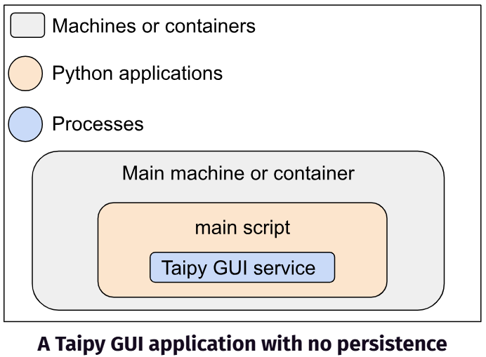
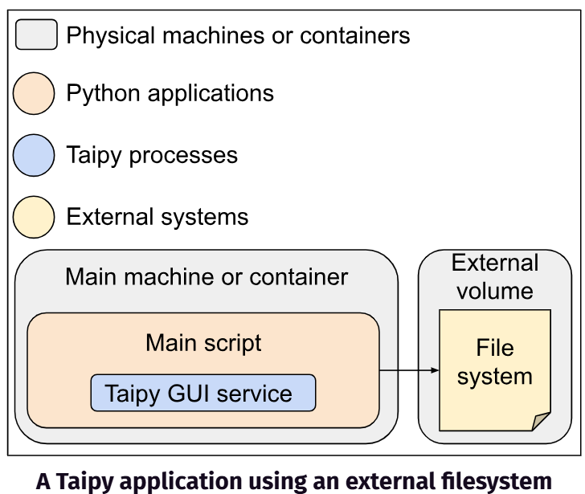
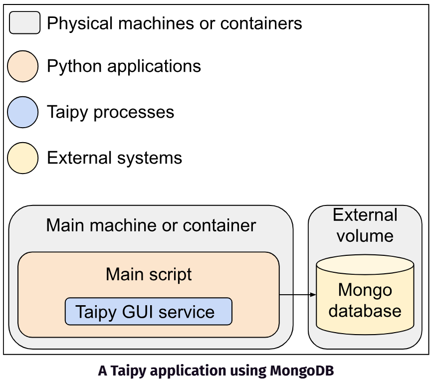
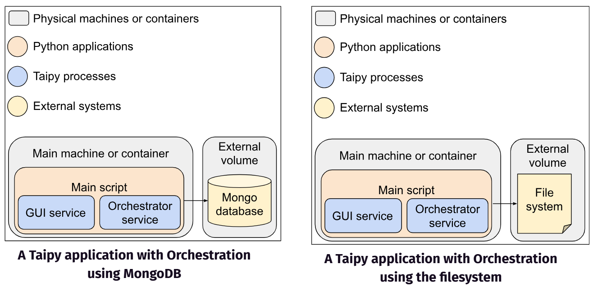
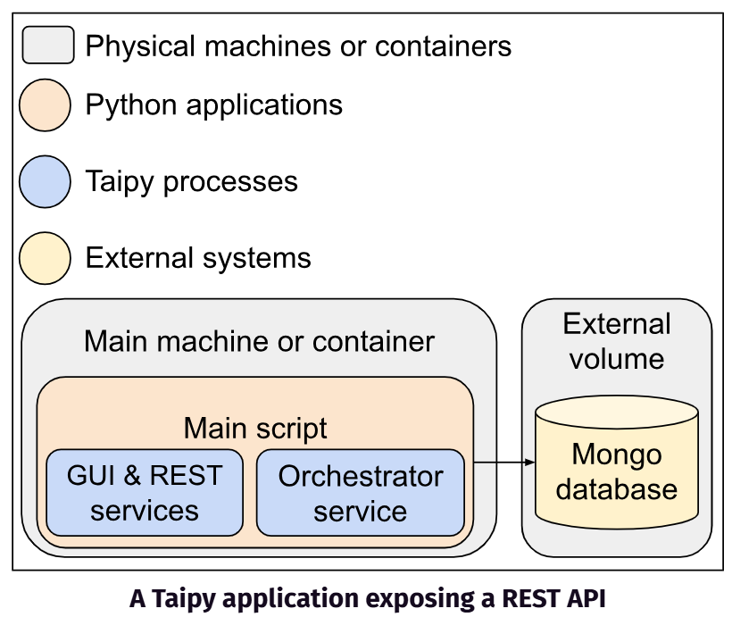
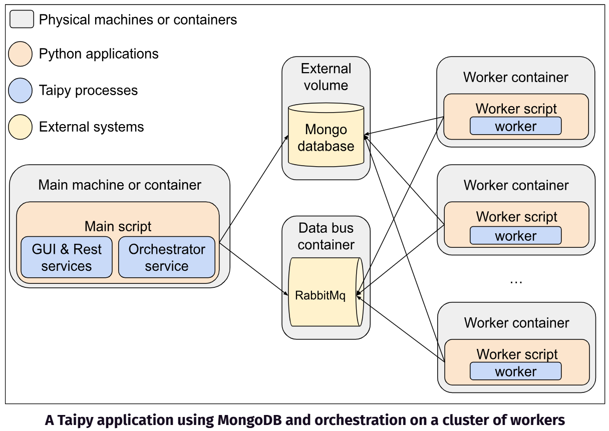
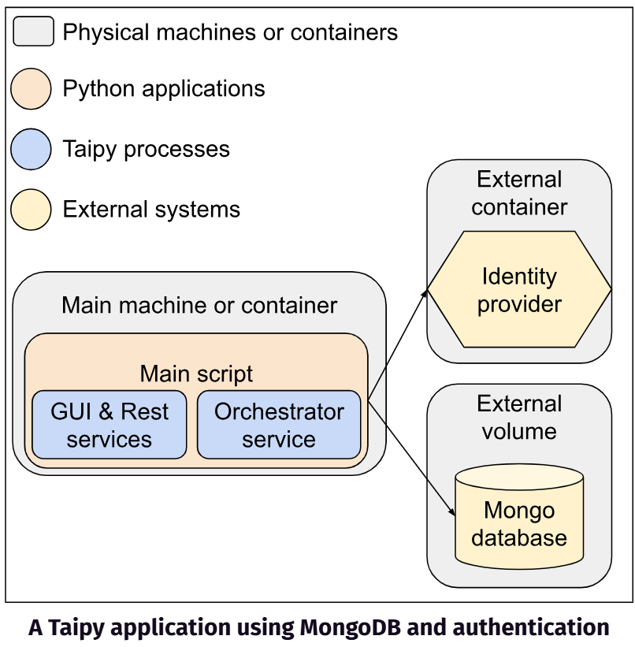

Depending on what Taipy functionalities and services are used and on how the application
is configured, the required resources and the architecture of a Taipy application may
vary. This page provides standard architecture examples for the most common use cases.

!!! note "Custom code requirements"

    A Taipy application may also contain user-defined custom code requiring specific
    resources (disk, database access, memory, external components or services access,
    etc.) and architecture (dedicated servers, network configuration, etc.). The
    user is responsible for providing the required resources. This document only covers
    resources needed by Taipy.

# A GUI application

This first use case consists of running an application only using the Taipy `Gui^`
service. It is suitable for many use cases, including dashboards, prototypes, demos,
or applications with just a few end-users. In this use case, the application does not
require data persistence.



TODO: improve schema, center, use Taipy colors, add a legend, etc.

In this configuration, the Taipy application consists of a single blocking process
that starts a web server (by default, a Flask web server). The whole application runs
as a Python script on a single machine. It does not persist data on a disk, an external
database, or a volume.

The main Python script looks like the following:

``` python title="main.py"
import taipy as tp

# your code here (define functions, callbacks, etc.)
...

if __name__ == "__main__":
    # your code here (Page and variable definition, gui configuration, application initialization, etc.)
    ...

    # Instantiate and run the Taipy services
    gui = tp.Gui(page="# Getting started with *Taipy*")
    tp.run(gui, title="Taipy application")
```

Taipy exposes a CLI to run the main script. Assuming the main script name
is `main.py`, here is the command line to run **on the main machine or container**:
``` console
$ taipy run main.py --port=5000 --host=192.168.0.1
```
With this command, a Flask web server is run. The Taipy User Interface is exposed on
`192.168.0.1` on port `5000`.

PLease refer to the [Running](../running/index.md) page for more running options, and
to the [Deploying](../deploying/index.md) page for more deployment details.

# With scenarios or data nodes

This use case involves running an application with the `Gui^` service, and using
scenarios or data nodes requiring data persistence. This is typically the case for
an interactive UI that requires user management, data integration, scenario
management, or what-if analysis either for single-user or multi-user. Basically,
the application needs to persist data nodes, scenarios, or other Taipy entities
between different runs of the application (application updates, restarts, etc.).

Taipy directly stores and manages entities (data nodes, scenarios, etc.). Two ways
to persist Taipy entities are available. They are called repositories:

- The **filesystem** repository (the default one) stores entities as JSON files on the
    disk
- The **mongo** repository stores entities in a MongoDB database

## File system repository

In this configuration, the Taipy application consists of a single blocking process
that starts a web server (by default, a Flask web server). The whole application
runs as a Python script on a single machine. Compared to the previous one, the main
difference in this case is that Taipy needs to store scenarios, data nodes, and
related entities using a disk file system.



TODO: improve schema, center, use Taipy colors, add a legend, etc.

Although a local filesystem running on the main machine can be used, we recommend
using an external volume mounted as the filesystem. This will facilitate application,
system, and data maintenance operations (updates, upgrades, patches, backups, etc.)

Here is a main Python script example showing what a typical code looks like:

``` python title="main.py"
import taipy as tp

# your code here (define functions, callbacks, etc.)
...

if __name__ == "__main__":
    # your code here (configure the data nodes, scenarios, etc.)
    ...
    my_data_node_config = Config.configure_datanode(...)
    my_scenario_config = Config.configure_scenario(...)

    # your code here (Page and variable definition, gui configuration, application initialization, etc.)
    ...
    data_node = tp.create_global_data_node(my_data_node_config)
    scenario = tp.create_scenario(my_scenario_config)

    # Instantiate and run the Taipy services
    gui = tp.Gui(page="# Getting started with *Taipy*")
    tp.run(gui, title="Taipy application")
```

This script still runs the `Gui^` service only. The difference is that the
code initializes the application creating a data node and a scenario.

Taipy exposes a CLI to run the main script. Assuming the main script name
is `main.py`, here is the command line to run **on the main machine or container**:
``` console
$ taipy run main.py --port=5000 --host=192.168.0.1
```
With this command, a Flask web server is run. The Taipy User Interface is exposed on
`192.168.0.1` on port `5000`.

## MongoDB repository

This case is similar to the previous one. The whole Taipy application consists of a
single blocking process starting a web server (by default, a Flask web server) and
running as a Python script on a single machine. The main difference is that Taipy
stores scenarios, data nodes, and related entities in a
[MongoDB](https://www.mongodb.com/docs/manual/installation/) database.

??? warning "Database management"

    Taipy does not manage the database; the user must set it up, manage it and ensure
    the main application can access it.
    Please refer to the official [MongoDB](https://www.mongodb.com/docs/manual/installation/)
    documentation for more details.



TODO: improve schema, center, use Taipy colors, add a legend, etc.

Although a database running on the main machine can be used, we recommend hosting
the Mongo database in an external volume. This will facilitate application, system,
and data maintenance operations (updates, upgrades, patches, backups, etc.)

The main Python script now needs to configure the repository. It looks like the
following:

``` python title="main.py"
import taipy as tp

# your code here (define functions, callbacks, etc.)
...

if __name__ == "__main__":
    # your code here (configure the data nodes, scenarios, etc.)
    ...
    tp.Config.configure_core(
        repository_type="mongo",
        repository_properties={
            "mongodb_hostname": "host",
            "mongodb_user": "username",
            "mongodb_password": "passwd",
            "mongodb_port": 27017,
            "application_db": "my_taipy_app",
        }
    )

    # your code here (Page and variable definition, gui configuration, application initialization, etc.)
    ...

    # Instantiate and run the Taipy services
    gui = tp.Gui(page="# Getting started with *Taipy*")
    tp.run(gui, title="Taipy application")
```

This main script example exhibits how to configure a Mongo repository. Note
that any configuration attributes, specifically those related to the Mongo
database, can be set in environment variables. Please refer to the
[Advanced configuration](../../advanced_features/configuration/advanced-config.md#override-with-file-in-env-variable)
page.

Taipy exposes a CLI to run the main script. Assuming the database is up and running,
and can be accessed from the main machine or container, here is the command line to
run **on the main machine or container**:
``` console
$ taipy run main.py --port=5000 --host=192.168.0.1
```
With this command, a Flask web server is run. The Taipy User Interface is exposed on
`192.168.0.1` on port `5000`.

# With the Orchestrator

This case involves running a Taipy application using the `Gui^` and `Orchestrator^`
services. The user code uses Taipy scenarios and tasks and submits them for an
asynchronous execution. For that purpose, Taipy spawns a dedicated process to
orchestrate the jobs next to the main process. Please refer to the
[task orchestration](../../scenario_features/task-orchestration/index.md)
page for more details.



TODO: improve schema, center, use Taipy colors, add a legend, etc.

Taipy directly manages and stores some Taipy entities. As explained before,
two storage systems called repositories are available (a filesystem or a Mongo
database). Both can be hosted in the same container as the main application but are
recommended to be hosted in an external volume to facilitate application, system,
and data maintenance operations (updates, upgrades, patches, backups, etc.).

The main script looks like the following example.

``` python title="main.py"
import taipy as tp

# your code here (define functions, callbacks, etc.)
...

if __name__ == "__main__":
    # your code here (configure the data nodes, scenarios, repository, etc.)
    ...
    tp.Config.configure_job_executions(mode="standalone")

    # your code here (Page and variable definition, gui configuration, application initialization, etc.)
    ...

    # Instantiate and run the Taipy services
    orchestrator = tp.Orchestrator()
    gui = tp.Gui(page="# Getting started with *Taipy*")
    tp.run(gui, orchestrator, title="Taipy application")
```
The `Gui^` and `Orchestrator^` services run together in this main script. It highlights
the `configure_job_executions` method used to configure the orchestrator and exhibits
what a typical code looks like.

Taipy exposes a CLI to run the main script. Assuming the database is up and running,()
and can be accessed from the main machine or container, here is the command line to
run **on the main machine or container**:
``` console
$ taipy run main.py --port=5000 --host=192.168.0.1
```
With this command, a Flask web server is run. The Taipy User Interface is exposed on
`192.168.0.1` on port `5000`.

# With a REST API

This case still considers using the `Gui^` and `Orchestrator^` services. In addition,
we want to expose REST APIs to access the Taipy entities (data nodes, scenarios, jobs,
etc.…) from an external component. Taipy exposes a `Rest^` Service for that. Please
refer to the [REST](../../scenario_features/rest/index.md) page for more details.

In this configuration, the `Rest^` and `Gui^` services use the same process.



TODO: improve schema, center, use Taipy colors, add a legend, etc.

Taipy directly manages and stores some Taipy entities. As explained before,
two storage systems called repositories are available (a filesystem or a Mongo
database). Both can be hosted in the same container as the main application but are
recommended to be hosted in an external volume to facilitate application, system,
and data maintenance operations (updates, upgrades, patches, backups, etc.).

The main script looks like the following:

``` python title="main.py"
import taipy as tp

# your code here (define functions, callbacks, etc.)
...

if __name__ == "__main__":
    # your code here (configure the data nodes, scenarios, repository, job execution, etc.)
    ...
    tp.Config.configure_rest()

    # your code here (Page and variable definition, gui configuration, application initialization, etc.)
    ...

    # Instantiate and run the Taipy services
    rest = tp.Rest()
    gui = tp.Gui(page="# Getting started with *Taipy*")
    tp.run(gui, rest, title="Taipy application")
```

Note that the `Rest^` service automatically runs the `Orchestrator^` service.

Taipy exposes a CLI to run the main script. Assuming the database is up and running,
and can be accessed from the main machine or container, here is the command line to
run **on the main machine or container**:
``` console
$ taipy run main.py --port=5000 --host=192.168.0.1
```
With this command, a Flask web server is run. The Taipy User Interface is exposed on
`192.168.0.1` on port `5000`.

# With remote workers

!!! note "Available in Taipy Enterprise edition"

    This section is relevant only to the [Taipy Enterprise Edition](https://taipy.io/enterprise)

    [Contact us](https://taipy.io/book-a-call){: .tp-btn .tp-btn--accent target='blank' }

Taipy offers the possibility of executing tasks on a remote cluster of workers.
This feature is called the cluster mode. This use case involves running a Taipy
application using the `Orchestrator^` service with a `mode` parameter set to `cluster`.

The user can run multiple workers in addition to the main script. A worker
corresponds to a run of a Python script named worker in a **dedicated container or
machine**. When running the worker script, a worker process is spawned. One can run
as many workers as needed.



A RabbitMq data bus is used as a pub/sub-communication system between the main
application and the workers. Note that Taipy does not manage RabbitMq itself.
The user must set it up and manage it. The user must also ensure the main
application and the workers can access the RabbitMQ data bus and the Mongo
database. Please refer to the official
[RabbitMQ](https://www.rabbitmq.com/docs) documentation for more details.

The main Python script looks like the following:

``` python title="main.py"
import taipy as tp

# your code here (define functions, callbacks, etc.)
...

if __name__ == "__main__":
    # your code here (configure the data nodes, scenarios, rest server, etc.)
    ...
    tp.Config.configure_core(
        repository_type="mongo",
        repository_properties={
            "mongodb_hostname": "host",
            "mongodb_user": "username",
            "mongodb_password": "passwd",
            "mongodb_port": 27017,
            "application_db": "my_taipy_app",
        })
    tp.Config.configure_job_executions(mode="cluster")

    # your code here (Page and variable definition, gui configuration, application initialization, etc.)
    ...

    # Instantiate and run the Taipy services
    orchestrator = tp.Orchestrator()
    gui = tp.Gui(page="# Getting started with *Taipy*")
    tp.run(gui, rest, title="Taipy application")
```

Taipy exposes a CLI to run the main script. Assuming the database and the RabbitMq
are up and running, and can be accessed from the main machine or container, here
is the command line to run **on the main machine or container**:
``` console
$ taipy run main.py --port=5000 --host=192.168.0.1
```
With this command, a Flask web server is run. The Taipy User Interface is exposed on
`192.168.0.1` on port `5000`.

Taipy exposes a CLI to start a worker. Assuming the database and the RabbitMq
are up and running, and can be accessed from the dedicated machine or container, here
is the command line to start **on the worker machine or container**:

``` console
$ taipy run-worker --application-path main.py
```
With this command, a worker is run. The worker automatically connects to the RabbitMq
data bus and communicates with the main application to execute jobs. You can start as
many worker machines as needed.

# With authentication

!!! note "Available in Taipy Enterprise edition"

    This section is relevant only to the [Taipy Enterprise Edition](https://taipy.io/enterprise)

    [Contact us](https://taipy.io/book-a-call){: .tp-btn .tp-btn--accent target='blank' }

An application may require users to be authenticated. Taipy provides a way to connect
to an identity providers. An external Identity Provider (such as an LDAP service)
authenticates users. The identity provider usually runs in an external container.



Taipy does not manage the identity provider itself: The user must set up and manage
it and ensure it is reachable by the main application.

The main Python script looks like the following:
``` python title="main.py"
import taipy as tp

# your code here (define functions, callbacks, etc.)
...


if __name__ == "__main__":
    # your code here (configure the data nodes, scenarios, repository, rest server, etc.)
    ...
    tp.Config.configure_authentication(
        protocol="ldap",
        server="ldap://0.0.0.0",
        base_dn="dc=example,dc=org",
        secret_key="my-secret",
        auth_session_duration = 600)

    # your code here (Page and variable definition, gui configuration, application initialization, etc.)
    ...
    with tp.auth.Authorize(tp.auth.login("username", "password")):
        data_node = tp.create_global_data_node(...)
        scenario = tp.create_scenario(...)

    # Instantiate and run the Taipy services
    orchestrator = tp.Orchestrator()
    gui = tp.Gui(page="# Getting started with *Taipy*")
    tp.run(gui, rest, title="Taipy application")
```

This script example exhibits how to configure the authentication. In this example,
an LDAP protocol is used, but other protocols are available.

Note that in most cases, the user and password are passed through the user interface.
However, if the application itself needs to be authorized, the password can be hashed
and passed as an environment variable. Please refer to the
[Authentication](../../advanced_features/auth/index.md) page for more details.
