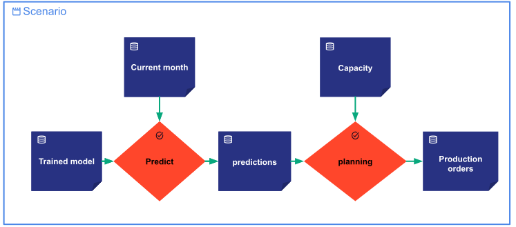

This page describes how to manage *scenarios* in Taipy. It explains how to configure,
create, submit and use *scenarios*.

A `Scenario^` in Taipy represents an instance of a business case that an end-user wants
to analyze, simulate, compare or solve.

A scenario holds some `DataNode^`s representing the scenario's data (datasets, parameters, models,
kpis, outputs, etc.). It can also hold a set `Task^`s reading and writing some of the scenario's
data nodes and representing the scenario's actions (training, predicting, planning, etc.).
Connected together, the tasks and the data nodes form an execution graph that can be submitted
for execution.

Submitting a scenario solves the instance of the business case modeled by the scenario and its
data.

??? example "Use case example"

    A company needs to forecast the monthly demand for a plant and generate the planning for the
    production orders. The forecasts and the planning is analyzed, computed and validated by the
    company's experts, that we call the end-users. A Taipy web application is implemented to help
    the end-users perform its job.

    === "Sceanrio's execution graph"

        { margin-left=25% }

        The graph above represents the flow of the scenario. It is an execution graph that contains
        the data nodes and the tasks of the scenario.

    ==== "Corresponding configuration code"

        ```python linenums="1"
        
        ```

        The code above shows the configuration of the scenario.

    An end-user instantiate a first scenario for January to forecast the demand and generate the
    planning under the January conditions. The scenario contains all the data nodes and tasks he
    needs to understand the January case.

    He can create other scenarios for the same month, change some data like the capacity to
    simulate different conditions, and share some others like the model and the month and compare
    the outcomes with the first scenario.

    He can also create other scenarios for February using the new information provided for the
    February period. And so on.

A `Scenario^` in Taipy is created from its configuration: a `ScenarioConfig^`.

# Scenario configuration

A scenario configuration is necessary to instantiate a `Scenario^`. To create a
`ScenarioConfig^`, you can use the `Config.configure_scenario()^` method passing
as parameters, an id, an optional list of task configurations, an optional list
of additional data node configurations, an optional frequency, optional sequences,
optional comparators, and optional properties.

For more details and examples, see the [scenario configuration](scenario-config.md)
page.

# Scenario creation

Once the scenario configuration is created, you can instantiate a `Scenario^` using
the `taipy.create_scenario()^` method. This method takes as parameters the scenario
configuration, an optional creation date (current time by default), and an optional
name.

This function creates and returns a new scenario from the scenario configuration
provided as a parameter. The scenario's creation also triggers the creation of the
related entities that do not exist yet:

- `Task^`: The tasks are created along with the scenario.
- `Sequence^`: If the scenario configuration has some default sequences specified,
    the scenario's sequences are created.
- `DataNode^`: The data nodes are created as well. If some data nodes are configured
    to be shared across multiple scenarios, they are created only if they do not exist
    yet. Otherwise, they are reused.
- `Cycle^`: If the scenario has a frequency and there isn’t any cycle corresponding
    to the scenario's creation date, a new *cycle* will be created.

!!! example "Examples"

    === "Simple scenario creation"
        The simplest way of creating a scenario is to call the `taipy.create_scenario()^`
        method providing a scenario configuration as a parameter. The code below uses
        the `monthly_scenario_cfg` configuration imported from the
        <a href="../code-example/index/my_config.py" download>`my_config.py`</a>
        module.

        ```python linenums="1"
        
        ```

        This code creates a scenario from the `monthly_scenario_cfg` configuration with
        the current date-time as the creation date.

    === "Scenario creation with parameters"
        Using the `monthly_scenario_cfg` configuration imported from the
        <a href="../code-example/index/my_config.py" download>`my_config.py`</a>
        module, here is an example of how to create a scenario with parameters.

        ```python linenums="1"
        
        ```

        In this small example, one scenario for January 2022 is instantiated. A
        `creation_date` and a `name` are provided.

        Note that the `monthly_scenario_cfg` configuration has a monthly frequency. Therefore,
        the new scenario is assigned to the cycle corresponding to its creation date (ie the month
        month of January 2022).

        Behind the scene, the other related entities are also created or reused.

# Scenario submission

Once a scenario is created, it can be submitted for execution using the `taipy.submit()^`
method. This method triggers the submission of all the scenario's tasks.

For each submission, a `Submission^` is created as well as a set of `Job^`s representing
each scenario's task execution. The `Submission^` object holds the information about the
submission of the scenario such as the *jobs*, the submission status, the submission date,
and other related information.

??? Note "Running the Orchestrator service"

    Running the Orchestrator service is required to execute jobs. To see how you can run
    different Taipy services, please refer to the
    [running Taipy services](../../../run-deploy/run/running_services.md) page.

!!! example

    The code below uses the `monthly_scenario_cfg` configuration imported from the
    <a href="../code-example/index/my_config.py" download>`my_config.py`</a>
    module to create and submit a scenario.

    ```python linenums="1"
    
    ```

    In this example, the `tp.submit()` method is used to trigger the scenario execution.
    Two `Job^`s are created, one for each task. A `Submission^`, is also created and returned
    by the `tp.submit()` method.

??? note "Another syntax."
    To submit a scenario, you can also use the `Scenario.submit()^` method:

    ```python linenums="1"
    
    ```

By default, Taipy executes the jobs asynchronously. If you want to wait until the submitted
jobs are finished, you can use the parameters *wait* and *timeout*.

By default, the parameter *wait* is False. If it is set to True, Taipy waits until all the
submitted jobs are finished. The parameter *timeout* represents a time span in seconds. It
can be an integer or a float. If *wait* is True and *timeout* is not specified or None, there
is no limit to the wait time. If *wait* is True and *timeout* is specified, Taipy waits until
all the submitted jobs are finished, or the timeout expires (which ever occurred first).

!!! example

    The code below uses the `monthly_scenario_cfg` configuration imported from the
    <a href="../code-example/index/my_config.py" download>`my_config.py`</a>
    module to create and submit a scenario.

    The submit method is called with the parameter _wait_ set to True and _timeout_ set to 60
    seconds. This means that the code will wait until all the submitted jobs are finished or
    until the timeout expires.

    ```python linenums="1"
    
    ```

??? note "Configuring Job execution"

    Multiple execution modes are available in Taipy. For more details, see the
    [configuring job execution](../../../advanced_features/configuration/job-config.md) page.

# Graphical User Interface

Taipy offers visual elements dedicated to scenario management. These elements are designed
to help end-users select, visualize, and edit scenarios and data nodes in an intuitive way.

For more details and examples, see the
[scenario visual elements](../../task-orchestration/vizelmts.md) and
[data nodes visual elements](../../data-integration/data-node-vizelmts.md) pages.

# Scenario attributes

The scenario creation method returns a `Scenario^` entity identified by a unique
identifier `id` that is generated by Taipy. A scenario also holds various properties,
each accessible as an attribute of the scenario:

- _**config_id**_ is the id of the scenario configuration.
- _**creation_date**_ corresponds to the date-time provided at the creation.
- _**is_primary**_ is True if it is a primary scenario. False otherwise.
- _**subscribers**_ is the list of Tuple(callbacks, params) representing the subscribers.
- _**version**_: The string indicates the application version of the scenario to instantiate.
    If not provided, the current version is used. For more details, refer to the
    [version management](../../../advanced_features/versioning/index.md) page.
- _**properties**_ is the complete dictionary of the scenario properties. It includes a copy
    of the properties of the scenario configuration, in addition to the properties provided
    at the creation and at runtime.
- _**cycle**_ is the cycle of the scenario.
- _**tasks**_ is a dictionary holding the various tasks of the scenario. The key corresponds
    to the task's _config_id_ (while the value is the task itself).
- _**additional_data_nodes**_ is a dictionary holding the various additional data nodes of
    the scenario. The key corresponds to the data node's _config_id_ (while the value is
    the data node itself).
- _**data_nodes**_ is a dictionary holding all data nodes of the scenario including those
    in the executable graph and the additional data nodes that are not part of the
    executable graph. The key corresponds to the data node's _config_id_ (while the value
    is the data node itself).
- _**sequences**_ is a dictionary holding the various sequences of the scenario. The key
    corresponds to the sequence's _config_id_ (while the value is the sequence itself).
- _**tag**_ is the tag used to search among the set of scenario's tags.
- _**owner_id**_ is the identifier of the owner, which is the cycle of the scenario.
- _**name**_ is the name of the scenario.
- Each property of the _**properties**_ dictionary is also directly exposed as an attribute.
- Each nested entity is also exposed as an attribute of the scenario. The attribute name
    corresponds to the _config_id_ of the nested entity.

!!! example

    The code below uses the `monthly_scenario_cfg` configuration imported from the
    <a href="../code-example/index/my_config.py" download>`my_config.py`</a>
    module to show the various scenario attributes available.

    ```python linenums="1"
    
    ```

# Get Scenarios

## Get by id

The first method to get a scenario is from its id by using the `taipy.get()^` method:

!!! example

    The code below uses the `monthly_scenario_cfg` configuration imported from the
    <a href="../code-example/index/my_config.py" download>`my_config.py`</a>
    module to demonstrate how to retrieve a scenario by its id.

    ```python linenums="1"
    
    ```

    Here, the two variables `scenario` and `scenario_retrieved` are equal.

## Get by config id

Scenarios can also be retrieved using `taipy.get_entities_by_config_id()^` providing
the config_id. This method returns the list of all existing scenarios instantiated
from the config_id provided as a parameter.

!!! example

    The code below uses the `monthly_scenario_cfg` configuration imported from the
    <a href="../code-example/index/my_config.py" download>`my_config.py`</a>
    module to demonstrate how to retrieve scenarios by a config_id.

    ```python linenums="1"
    
    ```

    In this example, the `all_monthly_scenarios` variable contains the two created
    scenarios since they share the same scenario configuration.


## Get all scenarios

All the scenarios can be retrieved using the method `taipy.get_scenarios()^`. This method returns
the list of all existing scenarios. To filter and sort the list of scenarios, you can use the
following parameters:

- *cycle* represents the optional `Cycle^` to filter scenarios by. If provided, the list
    contains all the existing scenarios of the cycle.
- *tag* represents the optional tag to filter scenarios by. If provided, the list contains all the
    existing scenarios tagged with the tag provided.
- *is_sorted* represents if the output list of scenarios is sorted using the sorting key.
    The default value is False.
- *descending* represents if the output list of scenarios is sorted in descending order.
    The default value is False.
- *sort_key* represents the optional sorting key to decide upon which key scenarios are sorted.
    The sorting key can be "name", "id", "creation_date", or "tags". The sorting is in increasing
    order for dates, in alphabetical order for name and id, and in lexicographical order for tags.
    The default value is "name". If an incorrect sorting key is provided, the scenarios are sorted
    by name.
- *created_start_time* represents the optional inclusive start date to filter scenarios by creation date.
- *created_end_time* represents the optional exclusive end date to filter scenarios by creation date.

!!! note

    If both a *cycle* and a *tag* are provided, the returned list contains scenarios that belong
    to the specified *cycle* and also have the specified *tag*.

## Get all scenarios grouped by cycles

All scenarios can be retrieved and grouped by their cycles by calling
`taipy.get_cycles_scenarios()^`. This method returns a dictionary with cycles as keys and
lists of corresponding scenarios as values.

## Get primary scenarios

The `taipy.get_primary()^` method returns the primary scenario of the cycle given as a
parameter.

The `taipy.get_primary_scenarios()^` method returns the primary scenarios for all the existing
cycles. The list of primary scenarios can be sorted and filtered using the following parameters:

- *is_sorted* represents if the output list of scenarios is sorted using the sorting key.
    The default value is False.
- *descending* represents if the output list of scenarios is sorted in descending order.
    The default value is False.
- *sort_key* represents the optional sorting key to decide upon which key scenarios are sorted.
    The sorting key can be "name", "id", "creation_date", or "tags". The sorting is in increasing
    order for dates, in alphabetical order for name and id, and in lexicographical order for tags.
    The default value is "name". If an incorrect sorting key is provided, the scenarios are sorted
    by name.
- *created_start_time* represents the optional inclusive start date to filter scenarios by creation date.
- *created_end_time* represents the optional exclusive end date to filter scenarios by creation date.

# Promote a scenario as primary

To set a scenario as _primary_, the `taipy.set_primary()^` method must be used. It promotes the
scenario given as a parameter to the _primary_ scenario of its cycle. If the cycle already had
a _primary_ scenario it will be demoted: It will no longer be _primary_ for the cycle.

# Delete a scenario

A scenario can be deleted by using `taipy.delete()^` which takes the scenario id as a parameter.
The deletion is also propagated to the nested sequences, tasks, data nodes, and jobs if they are
not shared with any other scenarios.

If there is more than one scenario in the cycle, an error will be raised if you try to delete a
primary scenario. You must promote another scenario as primary before deleting the primary one.
On the other hand, if there is only one scenario in the cycle, the primary scenario can be
deleted, which will also delete its cycle.

# Compare scenarios

You can compare two or more scenarios, created from the same scenario configuration, by
using `taipy.compare_scenarios()^`. This function accepts two or more scenarios to be
compared, you can also provide the data node config id to specify which data nodes from
the scenarios you want to compare.

!!! example

    The code below uses the `monthly_scenario_cfg` configuration imported from the
    <a href="../code-example/index/my_config.py" download>`my_config.py`</a>
    module to demonstrate how to compare scenarios.

    ```python linenums="1"
    
    ```

For more details and examples on how to compare scenarios, see the
[scenario comparison](../../what-if-analysis/scenario-comparison.md) page.

# Add or remove sequences

A scenario can have multiple sequences. You can add a sequence or sequences to a scenario
calling `Scenario.add_sequences()` and provide it with a dictionary with the key being the
sequence name and the value is a list of `Task^`s. In contrast, you can also remove a sequence
or sequences from a scenario using
`Scenario.remove_sequences()` and provide the function with a sequence name or a list of
sequence names.

!!! example

    The code below uses the `monthly_scenario_cfg` configuration imported from the
    <a href="../code-example/index/my_config.py" download>`my_config.py`</a>
    module to demonstrate how to add and remove sequences from a scenario.

    ```python linenums="1"
    
    ```

# Tag or untag a scenario

A scenario can have multiple tags. You can add a tag to a scenario using `taipy.tag()^`.
Alternatively, you can use the `Scenario.add_tag()^` method.

!!! example

    The code below uses the `monthly_scenario_cfg` configuration imported from the
    <a href="../code-example/index/my_config.py" download>`my_config.py`</a>
    module to demonstrate how to tag and untag a scenario.

    ```python linenums="1"
    
    ```

You can retrieve all scenarios that have a specific tag using `taipy.get_scenarios()^` with
the *tag* parameter.

You can remove a tag of a scenario using `taipy.untag()^`. Alternatively, you can use the
`Scenario.remove_tag()^` method. If the scenario does not have the specified tag, this will
have no effect.

!!! example

    The code below uses the `monthly_scenario_cfg` configuration imported from the
    <a href="../code-example/index/my_config.py" download>`my_config.py`</a>
    module to demonstrate how to untag a scenario.

    ```python linenums="1"
    
    ```

You can define a list of authorized tags in the scenario configuration by specifying the
value of *authorized_tags*. From the scenarios that are created from that configuration,
if you add a tag that is not authorized, an exception will be raised.

# Import/Export Scenarios

!!! warning "Available in Taipy Enterprise edition"

    This section is relevant only to the Enterprise edition of Taipy.

## Export a scenario

You can export a scenario with its related entities into an archive zip file using
`taipy.export_scenario()^`. This method takes as the parameters:

- *scenario_id* represents the id of the scenario to export.
- *output_path* represents the path to export the scenario. The path should include
    the file name without the extension or with the ".zip" extension. If the path exists
    and the override parameter is False, the `ExportPathAlreadyExists^` exception is raised.
- *override* (bool): is a boolean indicating if the export folder will be overridden when
    it exists. The default value is False.
- *include_data* is a boolean indicating if the data files of file-based data nodes are
    exported. File-based data nodes include Pickle, CSV, Excel, Parquet, and JSON data
    nodes. If the scenario has a data node that is not file-based, a warning will be
    logged, and the data of that data node will not be exported. The default value is False.

Alternatively, you can use the `Scenario.export()^` method and provide the same parameters
except for the *scenario_id* parameter.

!!! example

    The code below uses the `monthly_scenario_cfg` configuration imported from the
    <a href="../code-example/index/my_config.py" download>`my_config.py`</a>
    module to demonstrate how to export a scenario.

    ```python linenums="1"
    
    ```

## Import a scenario

You can import a scenario with its related entities and data files from the exported archive file
using `taipy.import_scenario()^` into the current version of the Taipy application. This method
takes as the parameters:

- *input_path* represents the path to the archive scenario to import. The archive scenario should
    contain all related entities of the scenario, and all entities should belong to the same
    version that is compatible with the current Taipy application version.
- *override* (bool): is a boolean indicating if the scenario will be overridden when it exists.
    The default value is False.

!!! example

    ```python linenums="1"
    
    ```

!!! warning

    If there is an error during the import process, the imported scenario and other imported entities
    will be deleted, and the error will be logged.
