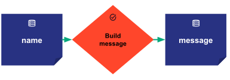

This section aims to build a *Hello world* example for task orchestration. It shows how to
quickly configure, create and submit a scenario. The following picture represents the scenario
execution graph made of two data nodes (blue boxes) and one task (orange box).

{width=75%}

It first consists in one data node named *input_name*. It represents an input data node.
Then a task named *build message* takes the first data node and returns a second data node named
*message*.

Building the corresponding Taipy application requires three easy steps.

# Configuring the application

The purpose is to configure the structure of the execution graph through the configuration
of the data nodes, tasks, and scenarios.

```python linenums="1"

```

In lines 4-5, we define the function used later in the task to configure.

In lines 8 and 9, we configure the two data nodes named *input_name* and *message*.

In line 10, we configure the task named *build_msg* representing the function `build_message()`.
Since the function has one parameter and returns one value, the task has one input data node
*input_name* and one output data node *message*.

Finally, in line 11, we configure the execution graph of the scenario providing the previously
configured task.

# Running Orchestrator service

Running Taipy Orchestrator as a service allows Taipy to set up all necessary variables to use
Scenario and Data Management functionalities.

``` python linenums="1"
from taipy import Orchestrator

if __name__ == "__main__":
    Orchestrator().run()
```

Line 3 is a standard boilerplate code that ensures the code is executed only from the main
module. It protects users from accidentally invoking the script when they didn't intend to. We
strongly recommend using it.

In line 4, we simply instantiate and run a Orchestrator service.

!!! warning "Orchestrator service should be run only once"

    At a given time, there should be only one Orchestrator service running. If
    an Orchestrator service instance is already running, running another
    Orchestrator service will raise an exception.

    To stop a Orchestrator service instance, you can use the `stop()` method.

    ```python linenums="1"
    from taipy import Orchestrator

    if __name__ == "__main__":
        orchestrator = Orchestrator()
        orchestrator.run()
        ...
        orchestrator.stop()
    ```

# Creating Scenarios and accessing data

Now you can create and manage *Scenarios*, submit the graph of *Tasks* for execution, and access
the *data nodes*.

```python linenums="1"
import taipy as tp

zinedine_scenario = tp.create_scenario(scenario_cfg)
zinedine_scenario.input_name.write("Zinedine")
zinedine_scenario.submit()
print(zinedine_scenario.message.read())

kylian_scenario = tp.create_scenario(scenario_cfg)
kylian_scenario.input_name.write("Kylian Mbappe")
kylian_scenario.submit()
print(kylian_scenario.message.read())
```

In line 3, method `tp.create_scenario()` instantiates the new scenario `zinedine_scenario`
from the scenario configuration built before.

In line 4, we get the input data node *input_name* of the `zinedine_scenario` and set its data
with the string value `"Zinedine"` using the method `write()`.

In line 5, the `zinedine_scenario` is submitted for an execution. This triggers the creation
and execution of a job. This job reads the input data node, passes the value
to the function `build_message()` and writes the result in the output data node.

Line 6 reads and prints the output data node *message* that has been written by the execution
of the scenario `zinedine_scenario`.

In line 8, we use the same scenario configuration to instantiate a second scenario:
`kylian_scenario`. Similarly, in lines 9-11, we write some value in its input data node, submit
it and print the result written in its output data node.

Here is the complete python code corresponding to the example:
<a href="./code-example/hello-world/hello-world.py" download>`hello-world.py`</a>

And here is the expected output.

``` console
[2023-02-08 20:19:35,062][Taipy][INFO] job JOB_build_msg_9e5a5c28-6c3e-4b59-831d-fcc8b43f882e is completed.
Hello Zinedine!
[2023-02-08 20:19:35,395][Taipy][INFO] job JOB_build_msg_684b8a3e-8e5a-406d-8790-009565ed57be is completed.
Hello Kylian Mbappe!
```

!!! note

    This third step consists in calling the various APIs to access, manage and submit the
    Taipy entities. Typically it is implemented in Python functions that are called by a
    graphical interface built with [Taipy GUI](../../gui/index.md).

    For example, the `tp.create_scenario()` or the `tp.submit()`
    methods are called when clicking respectively on a "create scenario"
    or "submit scenario" buttons. When displaying a data node in a graphical
    component (chart, table, etc. ) the `read()` and `write()` method are called
    to edit and retrieve the data.

    The [scenario selector](../../../refmans/gui/viselements/corelements/scenario_selector.md) and the
    [scenario viewer](../../../refmans/gui/viselements/corelements/scenario.md) are designed for this purpose.

!!! note

    Please refer to the
    [scenario management](../../../tutorials/articles/scenario_management_overview/index.md)
    tutorial for a more realistic use case.
